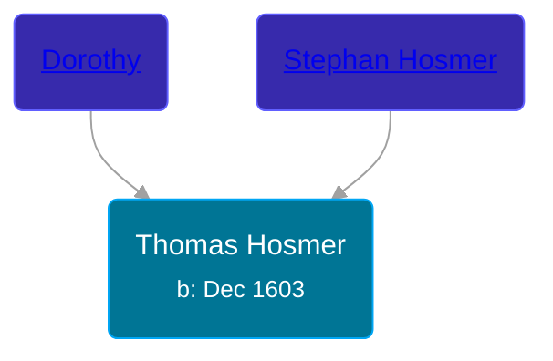

## 🔵 Thomas Hosmer
<small>Age: 83y, 4m, 12d</small>

Son of [Stephan Hosmer](/people/8/8785716) and [Dorothy ](/people/7/77992256)





### 📆 Events


Type | Date | Age at Event | Place
------ | ------ | ------ | ------
[Birth](#event-event-2) | Dec 1603 |  | Hawkhurst, Kent, England
[Death](#event-event-3) | 12 APR 1687 | 83y, 4m, 12d | Northampton, Massachusetts, USA



- **[Birth](#event-event-2)**
**Date**: Dec 1603, Age:
**Place**: Hawkhurst, Kent, England
- **[Death](#event-event-3)**
**Date**: 12 APR 1687, Age: 83y, 4m, 12d
**Place**: Northampton, Massachusetts, USA


## 👩‍❤️‍👨 Relationships

### 🟣 [Frances ](/people/1/15178620), b. 1602

#### Children With Frances
* 🟣 [Clemence Hosmer](/people/3/36338636)
* 🟣 [Hester Hosmer](/people/8/80112068), b.
* 🟣 [Hannah Hosmer](/people/7/74814464), b. 1637
* 🔵 [Stephen Hosmer](/people/5/53717358), b. 1645
### 📰 Event Sources

####  Birth, Dec 1603
* Genealogy of the Hosmer Family  - 4

####  Death, 12 APR 1687
* Genealogy of the Hosmer Family  - 3,4