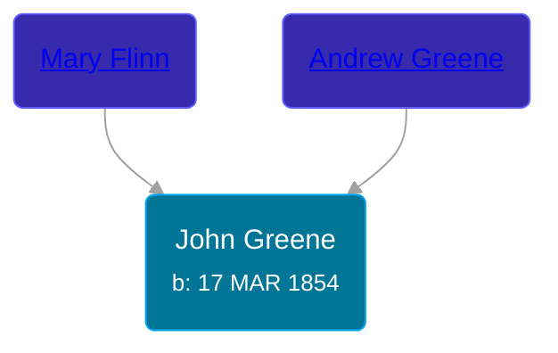

## 🔵 John Greene
<small>Age: 60y, 11d</small>

Son of [Andrew Greene](/people/7/70089858) and [Mary Flinn](/people/9/95328054)





### 📆 Events


Type | Date | Age at Event | Place
------ | ------ | ------ | ------
Birth | 17 MAR 1854 |  | Canada
[Residence](#event-event-0) | 21 JUN 1900 | 46y, 3m, 4d | Sciota, Shiawassee, Michigan, USA
[Residence](#event-event-1) | 21 APR 1910 | 56y, 1m, 4d | Owosso, Shiawassee, Michigan, USA
[Death](#event-event-5) | 28 MAR 1914 | 60y, 11d | Owosso, Shiawassee, Michigan, USA
[Burial](#event-event-6) |  |  | Saint Paul Cemetery, Owosso, Shiawassee, Michigan, USA



- **Birth**
**Date**: 17 MAR 1854, Age:
**Place**: Canada
- **[Residence](#event-event-0)**
**Date**: 21 JUN 1900, Age: 46y, 3m, 4d
**Place**: Sciota, Shiawassee, Michigan, USA
- **[Residence](#event-event-1)**
**Date**: 21 APR 1910, Age: 56y, 1m, 4d
**Place**: Owosso, Shiawassee, Michigan, USA
- **[Death](#event-event-5)**
**Date**: 28 MAR 1914, Age: 60y, 11d
**Place**: Owosso, Shiawassee, Michigan, USA
- **[Burial](#event-event-6)**
**Date**:
**Place**: Saint Paul Cemetery, Owosso, Shiawassee, Michigan, USA


## 👩‍❤️‍👨 Relationships

### 🟣 [Theresa Gillogly](/people/6/67581747), b. 20 JAN 1867

#### Children With Theresa Gillogly
* 🔵 [Andrew Greene](/people/5/54560240), b. abt 1892
* 🟣 [Leona Greene](/people/2/24282065), b. abt 1896
* 🟣 [Theresa Greene](/people/2/22213557), b. abt 1898
* 🟣 [Agnes Greene](/people/1/15565254), b. 14 FEB 1900
* 🔵 [Aldon Greene](/people/4/48950004), b. abt 1902
* 🟣 [Helen Greene](/people/6/65162976), b. 08 MAR 1908
### 📰 Event Sources

####  Residence, 21 JUN 1900
* 1900 US Census
>   
  > Name: John Green  
  > Age: 46  
  > Birth Date: Mar 1854  
  > Birthplace: Canada  
  > Home in 1900: Sciota, Shiawassee, Michigan  
  > Sheet Number: 14  
  > Number of Dwelling in Order of Visitation: 356  
  > Family Number: 364  
  > Race: White  
  > Gender: Male  
  > Immigration Year: 1870  
  > Relation to Head of House: Head  
  > Marital Status: Married  
  > Spouse's Name: Theresa Green  
  > Marriage Year: 1891  
  > Years Married: 9  
  > Father's Birthplace: Ireland  
  > Mother's Birthplace: Ireland  
  > Years in US: 29  
  > Naturalization: Naturalized  
  > Occupation: Farmer  
  > Months Not Employed: 0  
  > Can Read: Y  
  > Can Write: Y  
  > Can Speak English: Y  
  > House Owned or Rented: Own  
  > Home Free or Mortgaged: F  
  > Farm or House: F  
  >   
  > Household members:  
  > - John Green, 46, Head  
  > - Theresa Green, 33, Wife  
  > - Andrew Green, 8, Son  
  > - Leona Green, 4, Daughter  
  > - Lallie Green, 2, Daughter  
  > - Agnes Green, 3/12, Daughter  
  >

####  Residence, 21 APR 1910
* 1910 US Census
>   
  > Name: John Green  
  > Age in 1910: 65  
  > Birth Date: 1855  
  > Birthplace: Canada  
  > Home in 1910: Owosso Ward 5, Shiawassee, Michigan, USA  
  > Sheet Number: 10b  
  > Street: Mack  
  > House Number: 1223  
  > Race: White  
  > Gender: Male  
  > Relation to Head of House: Head  
  > Marital Status: Married  
  > Father's Birthplace: Ireland  
  > Mother's Birthplace: Ireland  
  > Native Tongue: English  
  > Occupation: Sander  
  > Industry: Sable Factory  
  > Employer, Employee or Other: Wage Earner  
  > Home Owned or Rented: Own  
  > Home Free or Mortgaged: Free  
  > Farm or House: House  
  > Able to read: Y  
  > Able to Write: Y  
  > Enumeration District Number: 0093  
  > Years Married: 19  
  > Out of Work: N  
  > Number of Weeks Out of Work: 4  
  > Enumerated Year: 1910  
  >   
  > Household members:  
  > - John Green, 65, Head    
  > - Theresa Green, 42, Wife    
  > - Andrew Green, 18, Son    
  > - Leona Green, 14, Daughter    
  > - Theresa Green, 12, Daughter    
  > - Agnes Green, 10, Daughter    
  > - Aldon Green, 8, Son    
  > - Helen Green, 2, Daughter    
  >

####  Death, 28 MAR 1914
* Michigan, Death Records, 1867-1950
>   
  > Name: John Green  
  > Gender: Male  
  > Race: White  
  > Marital Status: Married  
  > Death Age: 60  
  > Birth Date: 17 Mar 1854  
  > Birth Place: Canada  
  > Death Date: 28 Mar 1914  
  > Death Place: Owosso, Shiawassee, Michigan, USA  
  > Father: Andrew Green  
  > Mother: Mary Flinn

####  Burial
* findagrave.com
>   
  > Father  
  > John Greene  
  > b: 1854; d: 1914
