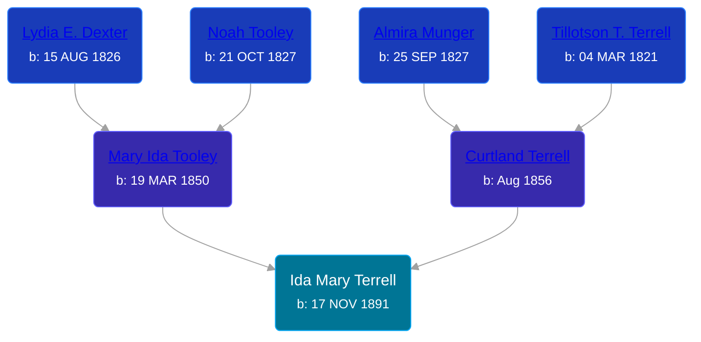

## 🟣 Ida Mary Terrell
<small>Age: 67y, 4m, 14d</small>

Daughter of [Curtland Terrell](/people/4/47972604) and [Mary Ida Tooley](/people/5/52009861)





### 📆 Events


Type | Date | Age at Event | Place
------ | ------ | ------ | ------
[Birth](#event-event-2) | 17 NOV 1891 |  | Paris Township, Kent, Michigan, USA
[Residence](#event-event-0) | 1894 | 2y, 13d | Paris Township, Kent, Michigan, USA
[Residence](#event-event-1) | 1900 | 8y, 13d | Paris Township, Kent, Michigan, USA
[Death](#event-event-5) | 31 MAR 1959 | 67y, 4m, 14d | Grand Rapids, Kent, Michigan, United States
Burial | 03 APR 1959 | 67y, 4m, 16d | Solon Township Cemetery



- **[Birth](#event-event-2)**
**Date**: 17 NOV 1891, Age:
**Place**: Paris Township, Kent, Michigan, USA
- **[Residence](#event-event-0)**
**Date**: 1894, Age: 2y, 13d
**Place**: Paris Township, Kent, Michigan, USA
- **[Residence](#event-event-1)**
**Date**: 1900, Age: 8y, 13d
**Place**: Paris Township, Kent, Michigan, USA
- **[Death](#event-event-5)**
**Date**: 31 MAR 1959, Age: 67y, 4m, 14d
**Place**: Grand Rapids, Kent, Michigan, United States
- **Burial**
**Date**: 03 APR 1959, Age: 67y, 4m, 16d
**Place**: Solon Township Cemetery


### 📰 Event Sources

####  Birth, 17 NOV 1891
* Kent County, Michigan Birth Returns

####  Residence, 1894
* 1894 Michigan State Census

####  Residence, 1900
* 1900 US Census

####  Death, 31 MAR 1959
* The Grand Rapids Press
>   
  > MATTHEWS -- Mrs. Ida P. Matthews, aged 67, of 1504 Leonard NE, formerly of Sand Lake, passed away Tuesday at Grand Rapids Osteopathic hospital after an extended illness Surviving are her husand Ray L.; a daughter, Mrs. Howard (Lillian) Covey of Grand Rapids; a sister, Mrs. Clara Geelhoed of Lowel; three brothers, Arthur Terrell of Sparta, William Miner of Hastings and Morris Miner; four grandchildren. Mrs. Matthews reposes at the Walsh-Bliss Funeral Home in Cedar Springs where services will be held Friday at 2:30. Interment Solon cemetery.
