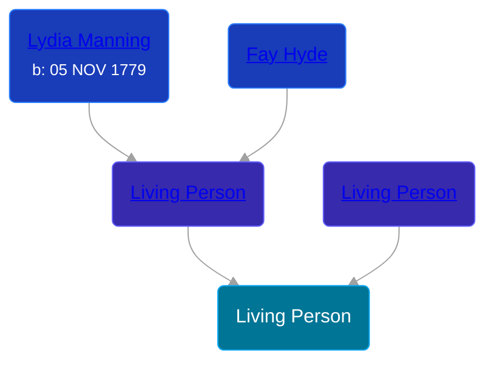

## 🔵 Living Person

Son of [Living Person](/people/9/94177081) and [Living Person](/people/9/90852736)



```mermaid
graph
classDef grands fill:#193cb8,stroke:#2b7fff,stroke-width:1px,color:#fff;
classDef parents fill:#372aac,stroke:#615fff,stroke-width:1px,color:#fff;
classDef primary fill:#007595,stroke:#00a6f4,stroke-width:1px,color:#fff;
71994776(Living Person):::primary
90852736(<a class="text-white" href="/people/9/90852736">Living Person</a>):::parents-->71994776
60730700(<a class="text-white" href="/people/6/60730700">Lydia Manning</a><br /><small>b: 05 NOV 1779</small>):::grands-->90852736
87942653(<a class="text-white" href="/people/8/87942653">Fay Hyde</a>):::grands-->90852736
94177081(<a class="text-white" href="/people/9/94177081">Living Person</a>):::parents-->71994776
linkStyle default stroke:#a1a1a1
```

