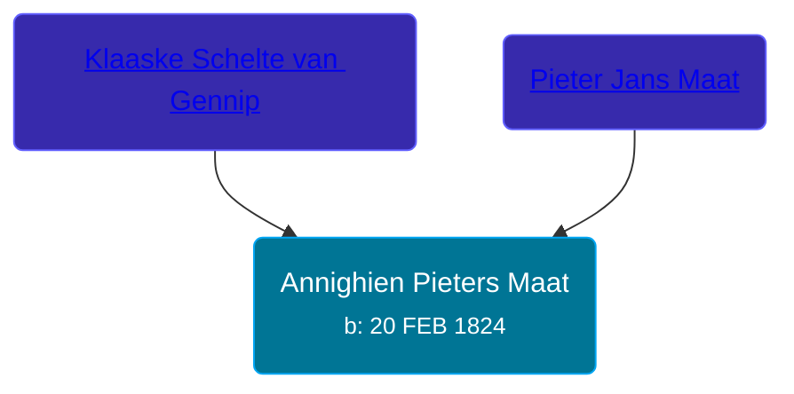

## 🟣 Annighien Pieters Maat
<small>Age: 86y, 16d</small>

Daughter of [Pieter Jans Maat](/people/7/79488014) and [Klaaske Schelte van Gennip](/people/1/196672)





### 📆 Events


Type | Date | Age at Event | Place
------ | ------ | ------ | ------
Birth | 20 FEB 1824 |  | Hellum, Slochteren, Netherlands
[Death](#event-event-4) | 06 MAR 1910 | 86y, 16d | Grand Rapids, Kent, Michigan, United States
Burial | 09 MAR 1910 | 86y, 19d | Garfield Park Cemetery, Grand Rapids, Kent, Michigan, United States



- **Birth**
**Date**: 20 FEB 1824, Age:
**Place**: Hellum, Slochteren, Netherlands
- **[Death](#event-event-4)**
**Date**: 06 MAR 1910, Age: 86y, 16d
**Place**: Grand Rapids, Kent, Michigan, United States
- **Burial**
**Date**: 09 MAR 1910, Age: 86y, 19d
**Place**: Garfield Park Cemetery, Grand Rapids, Kent, Michigan, United States


## 👩‍❤️‍👨 Relationships

### 🔵 [Sibrand Tiddes Olthof](/people/7/76433820), b. 12 AUG 1819

#### Events


Type | Date | Age at Event | Place
------ | ------ | ------ | ------
[Marriage](#event-family-0-event-0) | 06 MAR 1847 | 23y, 16d | Loppersum, Netherlands



- **[Marriage](#event-family-0-event-0)**
**Date**: 06 MAR 1847, Age: 23y, 16d
**Place**: Loppersum, Netherlands


#### Children With Sibrand Tiddes Olthof
* 🔵 [Pieter Olthof](/people/9/96395545), b. 02 APR 1847
* 🔵 [Tidde Olthof](/people/4/48588550), b. 16 FEB 1851
* 🟣 [Aalke Olthof](/people/1/12784340), b. 16 SEP 1857
* 🟣 [Ida Olthof](/people/6/60020862), b. 31 JAN 1864
* 🔵 [Jan Olthof](/people/2/25950288), b. 26 MAR 1868
### 📰 Event Sources

####  Marriage, 06 MAR 1847
* Dutch Civil Register
>   
  > Source Civil register - Marriage  
  > Archive location: Groninger Archieven  
  > General Municipality: Loppersum  
  > Type of record: Huwelijksakte  
  > Record number: 3  
  > Registration date: 06-03-1847  
  > Bridegroom: Sibrand Tiddes Olthof  
  > Place of birth: Loppersum  
  > Bride: Annighien Pieters Maat  
  > Place of birth: Hellum  
  > Father bridegroom: Tidde Freerks Olthof  
  > Mother bridegroom: Aalke Pieters Dijkema  
  > Father bride: Pieter Jans Maat  
  > Mother bride: Klaaske Schelte van Gennip  
  > Additional information: beroep bruidegom: boerenknegt; beroep vader bruidegom.: dagloner; beroep vader bruid: dagloner; beroep moeder bruid:dagloonster; bruidegom 27 jaar; bruid 23 jaar
* Netherlands, Civil Marriage Index, 1795-1950
>   
  > Name: Annighien Pieters Maat  
  > Gender: vrouwelijk (Female)  
  > Age: 23 jaar  
  > Birth Date: abt 1824  
  > Marriage Date: 6 mrt 1847 (6 Mar 1847)  
  > Marriage Place: Loppersum  
  > Father: Pieter Jans Maat  
  > Mother: Pieter Jans Maat  
  > Spouse: Sibrand Tiddes Olthof  
  > Gender: mannelijk (Male)  
  > Age: 27 jaar  
  > Birth Date: abt 1820  
  > Father: Tidde Freerks Olthof  
  > Mother: Aalke Pieters Dijkema

####  Death, 06 MAR 1910
* Michigan, Death Records, 1867-1950
>   
  > Name: Anna Ohthof [Anna Maat]   
  > Gender: Female  
  > Marital Status: Widowed  
  > Birth Date: Feb, 1824  
  > Birth Place: Netherlands  
  > Death Date: 6 Mar 1910  
  > Death Place: Grand Rapids, Kent, Michigan, USA  
  > Death Age: 86  
  > Father: Peter Maad  
  > Mother: Claske Sheltus
