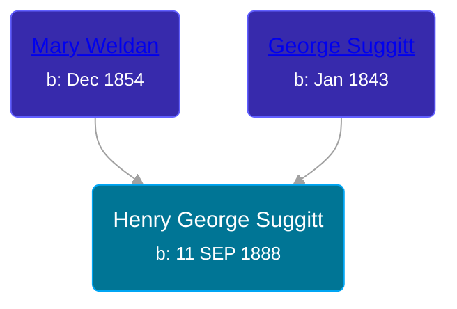

## 🔵 Henry George Suggitt
<small>Age: 88y, 2m, 19d</small>

Son of [George Suggitt](/people/4/48171276) and [Mary Weldan](/people/1/18538354)





### 📆 Events


Type | Date | Age at Event | Place
------ | ------ | ------ | ------
[Birth](#event-event-2) | 11 SEP 1888 |  | Neponset, Bureau, Illinois, USA
[Residence](#event-event-0) | 08 JUN 1900 | 11y, 8m, 27d | Neponset, Bureau, Illinois, USA
[Residence](#event-event-1) | 27 APR 1910 | 21y, 7m, 16d | Lincoln, Clay, Iowa, USA
[Residence](#event-event-2) | 14 FEB 1920 | 31y, 5m, 3d | Riverton Township, Clay, Iowa, USA
[Residence](#event-event-3) | 01 JAN 1925 | 36y, 3m, 20d | Lincoln, Clay, Iowa, USA
[Residence](#event-event-4) | 09 APR 1930 | 41y, 6m, 28d | Royal Town, Clay, Iowa, USA
[Death](#event-event-8) | Dec 1976 | 88y, 2m, 19d |



- **[Birth](#event-event-2)**
**Date**: 11 SEP 1888, Age:
**Place**: Neponset, Bureau, Illinois, USA
- **[Residence](#event-event-0)**
**Date**: 08 JUN 1900, Age: 11y, 8m, 27d
**Place**: Neponset, Bureau, Illinois, USA
- **[Residence](#event-event-1)**
**Date**: 27 APR 1910, Age: 21y, 7m, 16d
**Place**: Lincoln, Clay, Iowa, USA
- **[Residence](#event-event-2)**
**Date**: 14 FEB 1920, Age: 31y, 5m, 3d
**Place**: Riverton Township, Clay, Iowa, USA
- **[Residence](#event-event-3)**
**Date**: 01 JAN 1925, Age: 36y, 3m, 20d
**Place**: Lincoln, Clay, Iowa, USA
- **[Residence](#event-event-4)**
**Date**: 09 APR 1930, Age: 41y, 6m, 28d
**Place**: Royal Town, Clay, Iowa, USA
- **[Death](#event-event-8)**
**Date**: Dec 1976, Age: 88y, 2m, 19d
**Place**:


## 👩‍❤️‍👨 Relationships

### 🟣 [Claudine Dusina Hagedorn](/people/2/21896640), b. 27 JUN 1888

#### Events


Type | Date | Age at Event | Place
------ | ------ | ------ | ------
[Marriage](#event-family-0-event-0) | 05 JUN 1912 | 23y, 8m, 24d | Royal Town, Clay, Iowa, USA



- **[Marriage](#event-family-0-event-0)**
**Date**: 05 JUN 1912, Age: 23y, 8m, 24d
**Place**: Royal Town, Clay, Iowa, USA


#### Children With Claudine Dusina Hagedorn
* 🟣 [Living Person](/people/4/4805871)
* 🟣 [Vivian Mildred Suggitt](/people/9/90213536), b. 10 OCT 1917
* 🟣 [Doris M. Suggitt](/people/6/62856138), b. 22 JAN 1920
* 🔵 [Arley Duane Suggitt](/people/9/91694885), b. 01 JUN 1929
### 📰 Event Sources

####  Birth, 11 SEP 1888
* U.S., World War I Draft Registration Cards, 1917-1918
* Iowa, Marriage Records, 1880-1937

####  Residence, 08 JUN 1900
* 1900 US Census

####  Residence, 27 APR 1910
* 1910 US Census

####  Marriage, 05 JUN 1912
* U.S., Evangelical Lutheran Church of America, Records, 1875-1940
* Iowa, Marriage Records, 1880-1937
>   
  > No. of License: 3432  
  > Witness: Walter Suggitt  
  > Groom: George Suggitt  
  > Age next Birthday: 24  
  > Color: White  
  > Born: Neponsit Ill.  
  > Bride: Claudine Hagedorn  
  > Bride Age next Birthday: 23  
  > Birthplace: Germany  
  > Place married: Royal Iowa  
  > Married: June 5, 1912

####  Residence, 14 FEB 1920
* 1920 US Census

####  Residence, 01 JAN 1925
* 1925 Iowa State Census

####  Residence, 09 APR 1930
* 1930 US Census
####  Death, Dec 1976
* U.S., Social Security Death Index, 1935-2014
