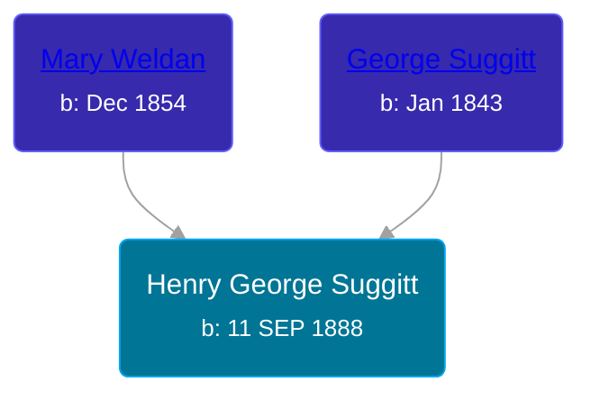

## 🔵 Henry George Suggitt
<small>Age: 88y, 2m, 19d</small>

Son of [George Suggitt](/people/4/48171276) and [Mary Weldan](/people/1/18538354)



```mermaid
graph
classDef grands fill:#193cb8,stroke:#2b7fff,stroke-width:1px,color:#fff;
classDef parents fill:#372aac,stroke:#615fff,stroke-width:1px,color:#fff;
classDef primary fill:#007595,stroke:#00a6f4,stroke-width:1px,color:#fff;
7271894(Henry George Suggitt<br /><small>b: 11 SEP 1888</small>):::primary
18538354(<a class="text-white" href="/people/1/18538354">Mary Weldan</a><br /><small>b: Dec 1854</small>):::parents-->7271894
48171276(<a class="text-white" href="/people/4/48171276">George Suggitt</a><br /><small>b: Jan 1843</small>):::parents-->7271894
linkStyle default stroke:#a1a1a1
```


### 📆 Events


Type | Date | Age at Event | Place
------ | ------ | ------ | ------
[Birth](#event-event-2) | 11 SEP 1888 |  | Neponset, Bureau, Illinois, USA
[Residence](#event-event-0) | 08 JUN 1900 | 11y, 8m, 27d | Neponset, Bureau, Illinois, USA
[Residence](#event-event-1) | 27 APR 1910 | 21y, 7m, 16d | Lincoln, Clay, Iowa, USA
[Residence](#event-event-2) | 14 FEB 1920 | 31y, 5m, 3d | Riverton Township, Clay, Iowa, USA
[Residence](#event-event-3) | 01 JAN 1925 | 36y, 3m, 20d | Lincoln, Clay, Iowa, USA
[Residence](#event-event-4) | 09 APR 1930 | 41y, 6m, 28d | Royal Town, Clay, Iowa, USA
[Residence](#event-event-5) | 04 APR 1950 | 61y, 6m, 23d | Sioux City, Woodbury, Iowa, USA
[Death](#event-event-9) | Dec 1976 | 88y, 2m, 19d |
[Burial](#event-event-10) |  |  | Memorial Park Cemetery, Sioux City, Woodbury, Iowa, USA



- **[Birth](#event-event-2)**
**Date**: 11 SEP 1888, Age:
**Place**: Neponset, Bureau, Illinois, USA
- **[Residence](#event-event-0)**
**Date**: 08 JUN 1900, Age: 11y, 8m, 27d
**Place**: Neponset, Bureau, Illinois, USA
- **[Residence](#event-event-1)**
**Date**: 27 APR 1910, Age: 21y, 7m, 16d
**Place**: Lincoln, Clay, Iowa, USA
- **[Residence](#event-event-2)**
**Date**: 14 FEB 1920, Age: 31y, 5m, 3d
**Place**: Riverton Township, Clay, Iowa, USA
- **[Residence](#event-event-3)**
**Date**: 01 JAN 1925, Age: 36y, 3m, 20d
**Place**: Lincoln, Clay, Iowa, USA
- **[Residence](#event-event-4)**
**Date**: 09 APR 1930, Age: 41y, 6m, 28d
**Place**: Royal Town, Clay, Iowa, USA
- **[Residence](#event-event-5)**
**Date**: 04 APR 1950, Age: 61y, 6m, 23d
**Place**: Sioux City, Woodbury, Iowa, USA
- **[Death](#event-event-9)**
**Date**: Dec 1976, Age: 88y, 2m, 19d
**Place**:
- **[Burial](#event-event-10)**
**Date**:
**Place**: Memorial Park Cemetery, Sioux City, Woodbury, Iowa, USA


## 👩‍❤️‍👨 Relationships

### 🟣 [Claudine Dusina Hagedorn](/people/2/21896640), b. 27 JUN 1888

#### Events


Type | Date | Age at Event | Place
------ | ------ | ------ | ------
[Marriage](#event-family-0-event-0) | 05 JUN 1912 | 23y, 8m, 24d | Royal Town, Clay, Iowa, USA



- **[Marriage](#event-family-0-event-0)**
**Date**: 05 JUN 1912, Age: 23y, 8m, 24d
**Place**: Royal Town, Clay, Iowa, USA


#### Children With Claudine Dusina Hagedorn
* 🟣 [Living Person](/people/4/4805871)
* 🟣 [Vivian Mildred Suggitt](/people/9/90213536), b. 10 OCT 1917
* 🟣 [Doris M. Suggitt](/people/6/62856138), b. 22 JAN 1920
* 🔵 [Arley Duane Suggitt](/people/9/91694885), b. 01 JUN 1929
### 📰 Event Sources

####  Birth, 11 SEP 1888
* U.S., World War II Draft Registration Cards, 1942
>   
  > Serial Number: 3627  
  > Name: Henry George Suggitt  
  > Place of Residence: 1305 Jennings St. Sioux City, Woodbury, Iowa  
  > Mailing Address: 1305 Jennings St. Sioux City, Woodbury, Iowa  
  > Telephone: 8-8262  
  > Age in years: 54  
  > Place of Birth: Neponset, Illionois  
  > Date of Birth: Sept 11, 1888  
  > Name and address of Person who will always know your address:   
  > Claudine Suggitt  
  > 1305 Jennings St, Sioux City, Iowa  
  > Employer's Name and Address:  
  > J. H. Marx Truck Line  
  > Place of Employment or Business:  
  > 1900 Ingleside Ave, Sioux City, Woodbury, Iowa
* Iowa, Marriage Records, 1880-1937
* U.S., World War I Draft Registration Cards, 1917-1918

####  Residence, 08 JUN 1900
* 1900 US Census

####  Residence, 27 APR 1910
* 1910 US Census

####  Residence, 14 FEB 1920
* 1920 US Census

####  Residence, 01 JAN 1925
* 1925 Iowa State Census

####  Residence, 09 APR 1930
* 1930 US Census

####  Residence, 04 APR 1950
* 1950 US Census
>   
  > Name: George Suggitt  
  > Age: 61  
  > Birth Date: abt 1889  
  > Gender: Male  
  > Race: White  
  > Birth Place: Illinois  
  > Marital Status: Married  
  > Relation to Head of House: Head  
  > Residence Date: 1950  
  > Home in 1950: Sioux City, Woodbury, Iowa, USA  
  > Street Name: Jennings  
  > House Number: 1305  
  > Dwelling Number: 88  
  > Farm: No  
  > Acres: No  
  > Occupation: Truck Driver  
  > Industry: Wilson Truck  
  > Father Birth Place: England  
  > Mother Birth Place: England  
  > Occupation Category: Working  
  > Hours Worked: 40  
  > Worker Class: Private  
  > Same House: Yes  
  > Grade Completed: Yes  
  > School Attendance: 30 or over  
  > Weeks Worked: 52  
  > Income: 3800  
  > Supplemental Income: 800  
  >   
  > Household members:  
  > - George Suggitt, 61, Head  
  > - Claudien Suggitt, 60, Wife  
  > - Arley Suggitt, 20, Son

####  Death, Dec 1976
* Sioux City Journal  - 28 Dec 1976
>   
  > H. George Suggitt  
  >   
  > H. George Suggitt, 88, 1305 Jennings St., died Monday at a Sioux City nursing home after an illness of several weeks.  
  >   
  > Services will be held at 11:30 a.m. Wednesday at Trinity Lutheran Church. The Rev. Russell J. Olson will officiate.  
  >   
  > Burial will be in Memorial Park Cemetery under the direction of the Nelson-Berger Northside Chapel. Pallbearers will be grandsons Rick and Randy Suggitt, Joe Beacom, Roger Moss and Dennis and Harry Hogan.  
  >   
  > Mr. Suggitt was born Sept. 11, 1888, at Neponset, Ill. He married Claudine D. Hagedorn on June 5, 1912, at Royal, Iowa. The couple lived in Clay County for several years, coming to Sioux City in 1931. Mr. Suggitt died March 3, 1967. Mr. Suggitt was a member of Trinity Lutheran Church.  
  >   
  > Survivors include one son, Arley of Sioux City; three daughters, Mrs. Gordon (Irma) Moss and Mrs. Ray (Vivian) Hogan, both of Sioux City and Mrs. Doris Beacom of Sergeant Bluff; 20 grandchildren and 26 great-grandchildren.  
  >
* U.S., Social Security Death Index, 1935-2014

####  Burial
* findagrave.com
>   
  > Suggitt, H. George  
  > b: Sept 11, 1888  
  > d: Dec 27, 1976
####  Marriage, 05 JUN 1912
* Iowa, Marriage Records, 1880-1937
>   
  > No. of License: 3432  
  > Witness: Walter Suggitt  
  > Groom: George Suggitt  
  > Age next Birthday: 24  
  > Color: White  
  > Born: Neponsit Ill.  
  > Bride: Claudine Hagedorn  
  > Bride Age next Birthday: 23  
  > Birthplace: Germany  
  > Place married: Royal Iowa  
  > Married: June 5, 1912
* U.S., Evangelical Lutheran Church of America, Records, 1875-1940
