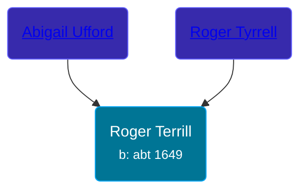

## 🔵 Roger Terrill
<small>Age: 73y, 4m, 17d</small>

Son of [Roger Tyrrell](/people/2/2108514) and [Abigail Ufford](/people/9/99473444)





### 📆 Events


Type | Date | Age at Event | Place
------ | ------ | ------ | ------
[Birth](#event-event-2) | abt 1649 |  |
[Death](#event-event-3) | 17 APR 1722 | 73y, 4m, 17d |



- **[Birth](#event-event-2)**
**Date**: abt 1649, Age:
**Place**:
- **[Death](#event-event-3)**
**Date**: 17 APR 1722, Age: 73y, 4m, 17d
**Place**:


### 📰 Event Sources

####  Birth, abt 1649
* Roger and Abigail (Ufford) Terrill and Some Descendants: 1632 - 1993  - 6

####  Death, 17 APR 1722
* Roger and Abigail (Ufford) Terrill and Some Descendants: 1632 - 1993  - 13