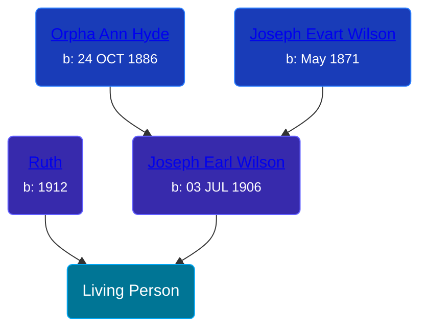

## 🟣 Living Person

Daughter of [Joseph Earl Wilson](/people/3/35616804) and [Ruth ](/people/7/72945090)



```mermaid
graph
classDef grands fill:#193cb8,stroke:#2b7fff,stroke-width:1px,color:#fff;
classDef parents fill:#372aac,stroke:#615fff,stroke-width:1px,color:#fff;
classDef primary fill:#007595,stroke:#00a6f4,stroke-width:1px,color:#fff;
73308950(Living Person):::primary
72945090(<a class="text-white" href="/people/7/72945090">Ruth </a><br /><small>b: 1912</small>):::parents-->73308950
35616804(<a class="text-white" href="/people/3/35616804">Joseph Earl Wilson</a><br /><small>b: 03 JUL 1906</small>):::parents-->73308950
63932813(<a class="text-white" href="/people/6/63932813">Orpha Ann Hyde</a><br /><small>b: 24 OCT 1886</small>):::grands-->35616804
57306025(<a class="text-white" href="/people/5/57306025">Joseph Evart Wilson</a><br /><small>b: May 1871</small>):::grands-->35616804
```


## 👩â€â¤ï¸â€ğŸ‘¨ Relationships

### 🔵 [Living Person](/people/9/96050920)
