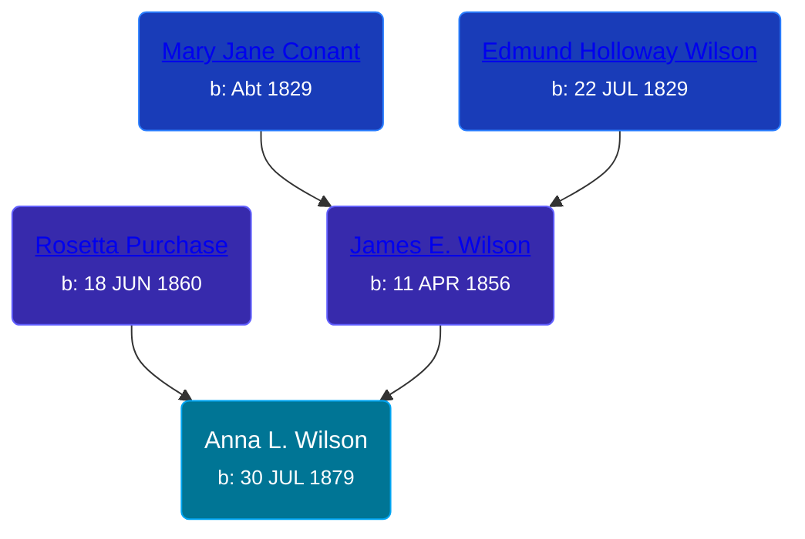

## 🟣 Anna L. Wilson

Daughter of [James E. Wilson](/people/5/54950695) and [Rosetta Purchase](/people/2/27770192)





### 📆 Events


Type | Date | Age at Event | Place
------ | ------ | ------ | ------
[Birth](#event-event-2) | 30 JUL 1879 |  | Robinson Township, Ottawa, Michigan, USA
[Residence](#event-event-0) | 1880 | 4m | Robinson Township, Ottawa, Michigan, USA
[Residence](#event-event-1) | 01 JUN 1900 | 20y, 10m, 1d | Manistee, Manistee, Michigan, USA



- **[Birth](#event-event-2)**
**Date**: 30 JUL 1879, Age:
**Place**: Robinson Township, Ottawa, Michigan, USA
- **[Residence](#event-event-0)**
**Date**: 1880, Age: 4m
**Place**: Robinson Township, Ottawa, Michigan, USA
- **[Residence](#event-event-1)**
**Date**: 01 JUN 1900, Age: 20y, 10m, 1d
**Place**: Manistee, Manistee, Michigan, USA


## 👩‍❤️‍👨 Relationships

### 🔵 [Wesley Demelvin Brown](/people/5/52698666), b. 03 APR 1876

#### Events


Type | Date | Age at Event | Place
------ | ------ | ------ | ------
[Marriage](#event-family-0-event-0) | 16 NOV 1899 | 20y, 3m, 16d | Grand Rapids, Kent, Michigan, United States



- **[Marriage](#event-family-0-event-0)**
**Date**: 16 NOV 1899, Age: 20y, 3m, 16d
**Place**: Grand Rapids, Kent, Michigan, United States


#### Children With Wesley Demelvin Brown
* 🟣 [Mabel Brown](/people/5/5853824), b. October 1899
### 📰 Event Sources

####  Birth, 30 JUL 1879
* Michigan, Births and Christenings Index, 1867-1911
>   
  > Name:Anna L Wilson  
  > Gender:Female  
  > Birth Place:Robinson, Ottawa, Michigan  
  > Birth Date:30 Jul 1879  
  > Father's name:James Wilson  
  > Mother's name:Rosetta Wilson  
  > FHL Film Number:984234

####  Residence, 1880
* 1880 US Census

####  Marriage, 16 NOV 1899
* Michigan, Marriage Records, 1867-1952
>   
  > Name:Anna Wilson  
  > Gender:Female  
  > Race:White  
  > Birth Year:abt 1879  
  > Birth Place:Robinson, Michigan  
  > Marriage Date:16 Nov 1899  
  > Marriage Place:Grand Rapids, Kent, Michigan, USA  
  > Age:20  
  > Residence Place:Tyrone Tp, Kent Co, Michigan  
  > Father:James Wilson  
  > Spouse:Wesley D Brown  
  > Gender:Male  
  > Race:White  
  > Birth Year:abt 1876  
  > Birth Place:Muskegon County, Michigan  
  > Age:23  
  > Residence Place:Tyrone Tp, Kent Co, Michigan  
  > Father:E M Brown  
  > Mother:Ada Holt  
  > Record Number:14162  
  > Film:65  
  > Film Description:1899 Genesee - 1899 Mason
####  Residence, 01 JUN 1900
* 1900 US Census
