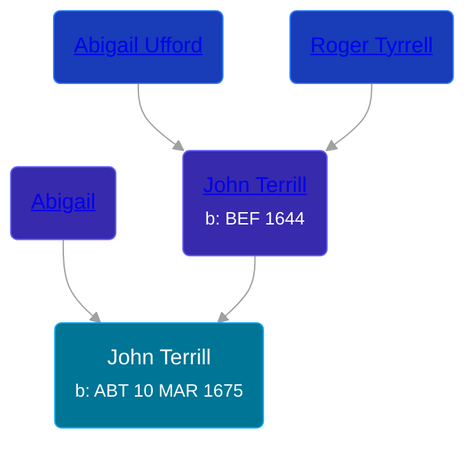

## 🔵 John Terrill

Son of [John Terrill](/people/6/65221157) and [Abigail ](/people/4/48582652)





### 📆 Events


Type | Date | Age at Event | Place
------ | ------ | ------ | ------
[Birth](#event-event-2) | ABT 10 MAR 1675 |  | Milford, Connecticut, USA



- **[Birth](#event-event-2)**
**Date**: ABT 10 MAR 1675, Age:
**Place**: Milford, Connecticut, USA


### 📰 Event Sources

####  Birth, ABT 10 MAR 1675
* Roger and Abigail (Ufford) Terrill and Some Descendants: 1632 - 1993  - 10