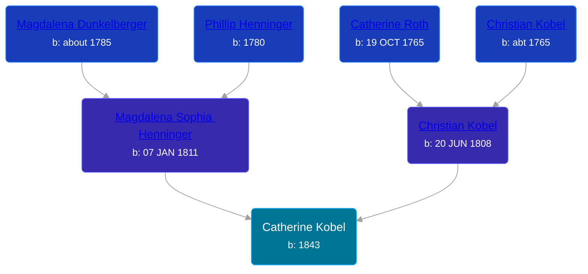

## 🟣 Catherine Kobel
<small>Age: 1y, 7m, 27d</small>

Daughter of [Christian Kobel](/people/1/17423128) and [Magdalena Sophia Henninger](/people/6/64241610)





### 📆 Events


Type | Date | Age at Event | Place
------ | ------ | ------ | ------
Birth | 1843 |  | Wayne, Ohio, USA
Death | 27 JUL 1844 | 1y, 7m, 27d |



- **Birth**
**Date**: 1843, Age:
**Place**: Wayne, Ohio, USA
- **Death**
**Date**: 27 JUL 1844, Age: 1y, 7m, 27d
**Place**:

