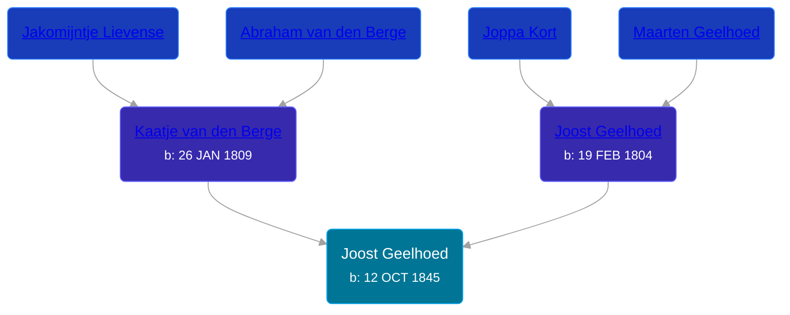

## 🔵 Joost Geelhoed
<small>Age: 85y, 2m, 10d</small>

Son of [Joost Geelhoed](/people/7/72031888) and [Kaatje van den Berge](/people/3/32271874)





### 📆 Events


Type | Date | Age at Event | Place
------ | ------ | ------ | ------
[Birth](#event-event-2) | 12 OCT 1845 |  | Dreischor, Zeeland, Netherlands
[Immigration](#event-event-0) | 17 MAY 1881 | 35y, 7m, 5d | New York, New York, United States
[Residence](#event-event-1) | 06 JUL 1900 | 54y, 8m, 24d | Paris Township, Kent, Michigan, USA
[Residence](#event-event-2) | 18 APR 1910 | 64y, 6m, 6d | Paris Township, Kent, Michigan, USA
[Residence](#event-event-3) | 17 APR 1930 | 84y, 6m, 5d | Cascade, Kent, Michigan, USA
[Death](#event-event-7) | 22 DEC 1930 | 85y, 2m, 10d | Cascade, Kent, Michigan, USA



- **[Birth](#event-event-2)**
**Date**: 12 OCT 1845, Age:
**Place**: Dreischor, Zeeland, Netherlands
- **[Immigration](#event-event-0)**
**Date**: 17 MAY 1881, Age: 35y, 7m, 5d
**Place**: New York, New York, United States
- **[Residence](#event-event-1)**
**Date**: 06 JUL 1900, Age: 54y, 8m, 24d
**Place**: Paris Township, Kent, Michigan, USA
- **[Residence](#event-event-2)**
**Date**: 18 APR 1910, Age: 64y, 6m, 6d
**Place**: Paris Township, Kent, Michigan, USA
- **[Residence](#event-event-3)**
**Date**: 17 APR 1930, Age: 84y, 6m, 5d
**Place**: Cascade, Kent, Michigan, USA
- **[Death](#event-event-7)**
**Date**: 22 DEC 1930, Age: 85y, 2m, 10d
**Place**: Cascade, Kent, Michigan, USA


## 👩‍❤️‍👨 Relationships

### 🟣 [Lavina van den Berge](/people/7/71558365), b. 18 MAY 1850

#### Events


Type | Date | Age at Event | Place
------ | ------ | ------ | ------
[Marriage](#event-family-0-event-0) | 15 MAY 1874 | 28y, 7m, 3d | Dreischor, Zeeland, Netherlands



- **[Marriage](#event-family-0-event-0)**
**Date**: 15 MAY 1874, Age: 28y, 7m, 3d
**Place**: Dreischor, Zeeland, Netherlands


#### Children With Lavina van den Berge
* 🟣 [Geelhoed](/people/6/62590620), b. 21 JAN 1875
* 🟣 [Cora Geelhoed](/people/2/21750520), b. 21 MAY 1876
* 🟣 [Jacoba Geelhoed](/people/9/93554380), b. 21 MAY 1876
* 🔵 [Joost Geelhoed](/people/7/79801340), b. 13 APR 1878
* 🔵 [Cornelius Geelhoed](/people/9/92844960), b. 23 DEC 1879
* 🔵 [Abraham Geelhoed](/people/9/94665728), b. 13 DEC 1880
* 🔵 [Abraham Geelhoed](/people/4/47951154), b. 23 DEC 1881
* 🟣 [Katie Geelhoed](/people/7/74962834), b. Sep 1886
### 📰 Event Sources

####  Birth, 12 OCT 1845
* Geelhoet, Geelhoed & Geelhoedt Genealogie  - 140

####  Marriage, 15 MAY 1874
* Netherlands, Civil Marriage Index, 1795-1950
>   
  > Name:Joost Geelhoed  
  > Gender:mannelijk (Male)  
  > Age:28  
  > Birth Date:abt 1846  
  > Marriage Date:15 mei 1874 (15 May 1874)  
  > Marriage Place:Dreischor  
  > Father:Joost Geelhoed  
  > Mother:Kaatje van den Berge  
  > Spouse:Levina van den Berge  
  > Gender:vrouwelijk (Female)  
  > Age:23  
  > Birth Date:abt 1851  
  > Father:Cornelis van den Berge
* Geelhoet, Geelhoed & Geelhoedt Genealogie  - 140
* Dutch Civil Register
>   
  > Source Civil register - Marriage  
  > Archive location Zeeuws Archief  
  > General Number of finding aid: 25.25  
  > Municipality: Dreischor  
  > Type of record: Huwelijksakte  
  > Record number: 12  
  > Registration date: 15-05-1874  
  > Groom: Joost Geelhoed  
  > Age: 28  
  > Place of birth: Dreischor  
  > Bride: Levina van den Berge  
  > Age: 23  
  > Place of birth: Dreischor  
  > Father groom: Joost Geelhoed  
  > Mother groom: Kaatje van den Berge  
  > Father bride: Cornelis van den Berge  
  > Mother bride: Jacoba Filee

####  Immigration, 17 MAY 1881
* New York, Passenger Lists, 1820-1957

####  Residence, 06 JUL 1900
* 1900 US Census

####  Residence, 18 APR 1910
* 1910 US Census

####  Residence, 17 APR 1930
* 1930 US Census
####  Death, 22 DEC 1930
* Geelhoet, Geelhoed & Geelhoedt Genealogie  - 140
