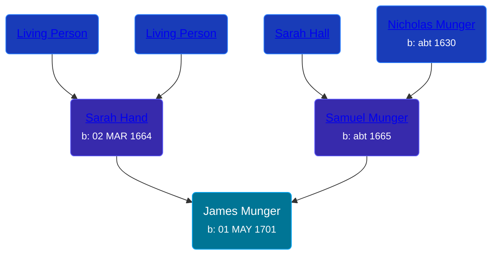

## 🔵 James Munger
<small>Age: 79y, 8m, 9d</small>

Son of [Samuel Munger](/people/5/57362828) and [Sarah Hand](/people/7/75255100)





### 📆 Events


Type | Date | Age at Event | Place
------ | ------ | ------ | ------
[Birth](#event-event-2) | 01 MAY 1701 |  | Guilford, Connecticut, USA
[Death](#event-event-3) | 10 JAN 1781 | 79y, 8m, 9d |



- **[Birth](#event-event-2)**
**Date**: 01 MAY 1701, Age:
**Place**: Guilford, Connecticut, USA
- **[Death](#event-event-3)**
**Date**: 10 JAN 1781, Age: 79y, 8m, 9d
**Place**:


### 📰 Event Sources

####  Birth, 01 MAY 1701
* The Munger Book  - 203

####  Death, 10 JAN 1781
* The Munger Book  - 203