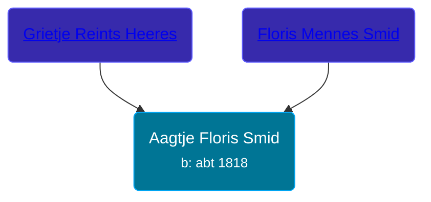

## 🟣 Aagtje Floris Smid

Daughter of [Floris Mennes Smid](/people/4/45597600) and [Grietje Reints Heeres](/people/8/87985942)





### 📆 Events


Type | Date | Age at Event | Place
------ | ------ | ------ | ------
Birth | abt 1818 |  |



- **Birth**
**Date**: abt 1818, Age:
**Place**:


## 👩‍❤️‍👨 Relationships

### 🔵 [Freerk Tidde Olthof](/people/1/17887459), b. abt 1817

#### Events


Type | Date | Age at Event | Place
------ | ------ | ------ | ------
[Marriage](#event-family-0-event-0) | 1841 | 23y |



- **[Marriage](#event-family-0-event-0)**
**Date**: 1841, Age: 23y
**Place**:


### 📰 Event Sources

####  Marriage, 1841
* Dutch Civil Register
>   
  > Source Civil register - Marriage  
  > Archive location: Groninger Archieven  
  > General Municipality: 't Zandt  
  > Type of record: Huwelijksakte  
  > Record number: 21  
  > Registration date: 17-11-1841  
  > Bridegroom: Freerk Tiddes Olthof  
  > Place of birth: Westeremden  
  > Bride: Aagtje Floris Smid  
  > Place of birth: Leermens  
  > Father bridegroom: Tidde Freerks Olthof  
  > Mother bridegroom: Aalke Pieters Dijkema  
  > Father bride: Floris Mennes Smid  
  > Mother bride: Grietje Reints Heeres  
  > Additional information: beroep bruidegom: boerenknecht; beroep bruid: boerenknecht; beroep vader bruidegom.: daglooner; beroep moeder bruid:werkvrouw; bruidegom 24 jaar; bruid 23 jaar