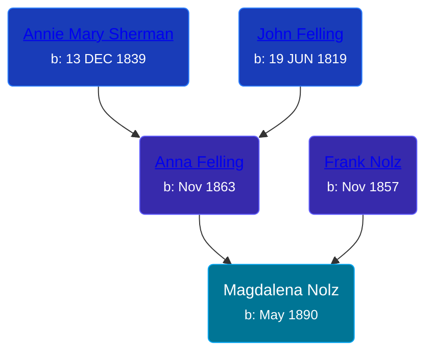

## 🟣 Magdalena Nolz

Daughter of [Frank Nolz](/people/6/61628928) and [Anna Felling](/people/1/1735561)





### 📆 Events


Type | Date | Age at Event | Place
------ | ------ | ------ | ------
Birth | May 1890 |  | Minnesota, USA
[Residence](#event-event-0) | 12 JUN 1895 | 5y, 1m, 12d | St Paul, Ramsey, Minnesota, USA
[Residence](#event-event-1) | 06 JUN 1900 | 10y, 1m, 6d | St Paul, Ramsey, Minnesota, USA



- **Birth**
**Date**: May 1890, Age:
**Place**: Minnesota, USA
- **[Residence](#event-event-0)**
**Date**: 12 JUN 1895, Age: 5y, 1m, 12d
**Place**: St Paul, Ramsey, Minnesota, USA
- **[Residence](#event-event-1)**
**Date**: 06 JUN 1900, Age: 10y, 1m, 6d
**Place**: St Paul, Ramsey, Minnesota, USA


### 📰 Event Sources

####  Residence, 12 JUN 1895
* 1895 Minnesota State Census

####  Residence, 06 JUN 1900
* 1900 US Census
