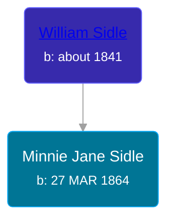

## 🟣 Minnie Jane Sidle
<small>Age: 55y, 6m, 17d</small>

Daughter of [William Sidle](/people/3/31146208)





### 📆 Events


Type | Date | Age at Event | Place
------ | ------ | ------ | ------
Birth | 27 MAR 1864 |  | Michigan, USA
[Residence](#event-event-0) | 01 JUN 1880 | 16y, 2m, 4d | Grant, Newaygo, Michigan, USA
[Residence](#event-event-1) | 1884 | 19y, 8m, 3d | Grant, Newaygo, Michigan, USA
[Residence](#event-event-2) | 02 JUN 1900 | 36y, 2m, 5d | Bingham, Leelanau, Michigan, USA
[Residence](#event-event-3) | 26 APR 1910 | 46y, 29d | Manhattan, New York, USA
[Death](#event-event-8) | 14 OCT 1919 | 55y, 6m, 17d | Grand Rapids, Kent, Michigan, United States
[Burial](#event-event-9) |  |  | Fairplains Cemetery, Grand Rapids, Kent, Michigan, United States



- **Birth**
**Date**: 27 MAR 1864, Age:
**Place**: Michigan, USA
- **[Residence](#event-event-0)**
**Date**: 01 JUN 1880, Age: 16y, 2m, 4d
**Place**: Grant, Newaygo, Michigan, USA
- **[Residence](#event-event-1)**
**Date**: 1884, Age: 19y, 8m, 3d
**Place**: Grant, Newaygo, Michigan, USA
- **[Residence](#event-event-2)**
**Date**: 02 JUN 1900, Age: 36y, 2m, 5d
**Place**: Bingham, Leelanau, Michigan, USA
- **[Residence](#event-event-3)**
**Date**: 26 APR 1910, Age: 46y, 29d
**Place**: Manhattan, New York, USA
- **[Death](#event-event-8)**
**Date**: 14 OCT 1919, Age: 55y, 6m, 17d
**Place**: Grand Rapids, Kent, Michigan, United States
- **[Burial](#event-event-9)**
**Date**:
**Place**: Fairplains Cemetery, Grand Rapids, Kent, Michigan, United States


## 👩‍❤️‍👨 Relationships

### 🔵 [John Levi Hyde](/people/2/23020300), b. 08 DEC 1845

#### Events


Type | Date | Age at Event | Place
------ | ------ | ------ | ------
[Marriage](#event-family-0-event-0) | 03 SEP 1880 | 16y, 5m, 6d | Ashland, Michigan, USA



- **[Marriage](#event-family-0-event-0)**
**Date**: 03 SEP 1880, Age: 16y, 5m, 6d
**Place**: Ashland, Michigan, USA


#### Children With John Levi Hyde
* 🟣 [Rosa A. Hyde](/people/1/1137888), b. 08 AUG 1881
* 🟣 [Rhoda E. Hyde](/people/9/98029194), b. about 1882
* 🔵 [William C. Hyde](/people/2/28984848), b. June 1882
* 🟣 [Orpha Ann Hyde](/people/6/63932813), b. 24 OCT 1886
### 🔵 [Living Person](/people/4/42014344)

### 📰 Event Sources

####  Residence, 01 JUN 1880
* 1880 US Census

####  Residence, 1884
* 1884 Michigan State Census

####  Residence, 02 JUN 1900
* 1900 US Census

####  Residence, 26 APR 1910
* 1910 US Census

####  Death, 14 OCT 1919
* Michigan, Death Records, 1867-1950
>   
  > Name: Mennie Park  
  > [Mennie Siddle]   
  > Gender: Female  
  > Marital Status: Married  
  > Birth Date: Mar, 1864  
  > Birth Place: Michigan  
  > Death Date: 16 Oct 1919  
  > Death Place: Grand Rapids, Kent, Michigan, USA  
  > Death Age: 55  
  > File Number: 237  
  > Father: William Siddle
* The Grand Rapids Press
>   
  > PARK -- Mrs. Minnie Park, aged 55 years, wife of cassius Park, 2088 Michigan st, N. E., died Oct. 16, 1919. Surviving are the husband, two sons, four daughters. Funeral services Monday afternoon at 2 o'clock at the Fairmount Mission church, north of Knapp st. Interment Fair Plains cemetery.

####  Burial
* findagrave.com

####  Marriage, 03 SEP 1880
* Michigan, Marriage Records, 1867-1952
>   
  > Name: John S Hyde  
  > Gender: Male  
  > Race: White  
  > Birth Year: abt 1847  
  > Birth Place: New York  
  > Marriage Date: 3 Sep 1880  
  > Marriage Place: Ashland, Michigan, USA  
  > Age: 33  
  > Residence Place: Ashland  
  > Spouse: Armeda J Sidle  
  > Spouse Gender: Female  
  > Spouse Race: White  
  > Spouse Age: 16  
  > Spouse Birth Place: Canada  
  > Spouse Residence Place: Ashland  
  > Record Number: 1069  
  > Film: 20  
  > Film Description: 1880 Marquette - 1881 Berrien