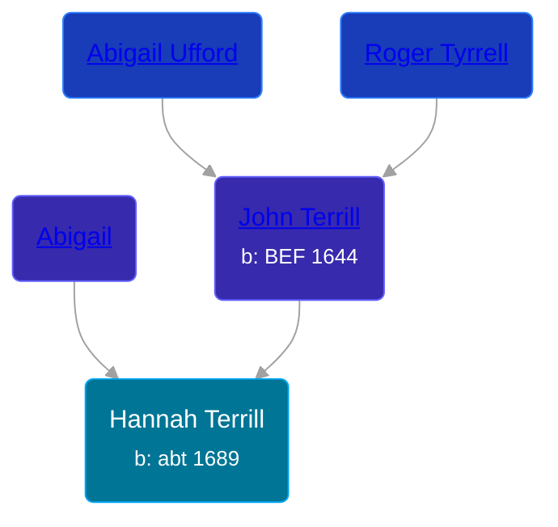

## 🟣 Hannah Terrill

Daughter of [John Terrill](/people/6/65221157) and [Abigail ](/people/4/48582652)





### 📆 Events


Type | Date | Age at Event | Place
------ | ------ | ------ | ------
[Birth](#event-event-2) | abt 1689 |  | Milford, Connecticut, USA
[Baptism](#event-event-0) | 08 SEP 1689 | 9m, 8d |



- **[Birth](#event-event-2)**
**Date**: abt 1689, Age:
**Place**: Milford, Connecticut, USA
- **[Baptism](#event-event-0)**
**Date**: 08 SEP 1689, Age: 9m, 8d
**Place**:


### 📰 Event Sources

####  Birth, abt 1689
* Roger and Abigail (Ufford) Terrill and Some Descendants: 1632 - 1993  - 10

####  Baptism, 08 SEP 1689
* Roger and Abigail (Ufford) Terrill and Some Descendants: 1632 - 1993  - 10