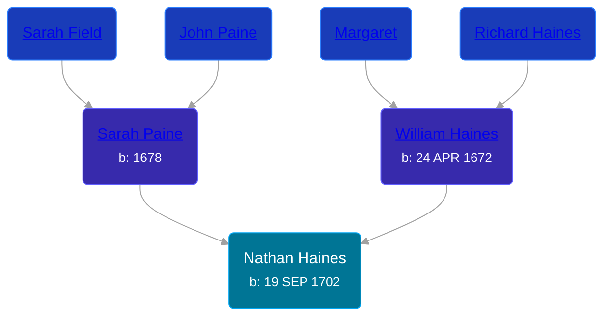

## 🔵 Nathan Haines
<small>Age: 48y, 10m, 17d</small>

Son of [William Haines](/people/5/5796916) and [Sarah Paine](/people/6/64473277)





### 📆 Events


Type | Date | Age at Event | Place
------ | ------ | ------ | ------
Birth | 19 SEP 1702 |  | Evesham Township, Burlington, New Jersey, USA
Death | 06 AUG 1751 | 48y, 10m, 17d | Northampton, Burlington, New Jersey, USA



- **Birth**
**Date**: 19 SEP 1702, Age:
**Place**: Evesham Township, Burlington, New Jersey, USA
- **Death**
**Date**: 06 AUG 1751, Age: 48y, 10m, 17d
**Place**: Northampton, Burlington, New Jersey, USA


## 👩‍❤️‍👨 Relationships

### 🟣 [Sarah Austin](/people/4/4530755), b. 1704

#### Events


Type | Date | Age at Event | Place
------ | ------ | ------ | ------
Marriage | BET 01 MAR 1724 AND 01 MAR 1726 | 21y, 5m, 12d | Haddenfield, Gloucester, New Jersey, USA



- **Marriage**
**Date**: BET 01 MAR 1724 AND 01 MAR 1726, Age: 21y, 5m, 12d
**Place**: Haddenfield, Gloucester, New Jersey, USA


#### Children With Sarah Austin
* 🟣 [Mary Haines](/people/5/53194016), b. 1737
### 📰 Event Sources

####  Marriage, BET 01 MAR 1724 AND 01 MAR 1726
