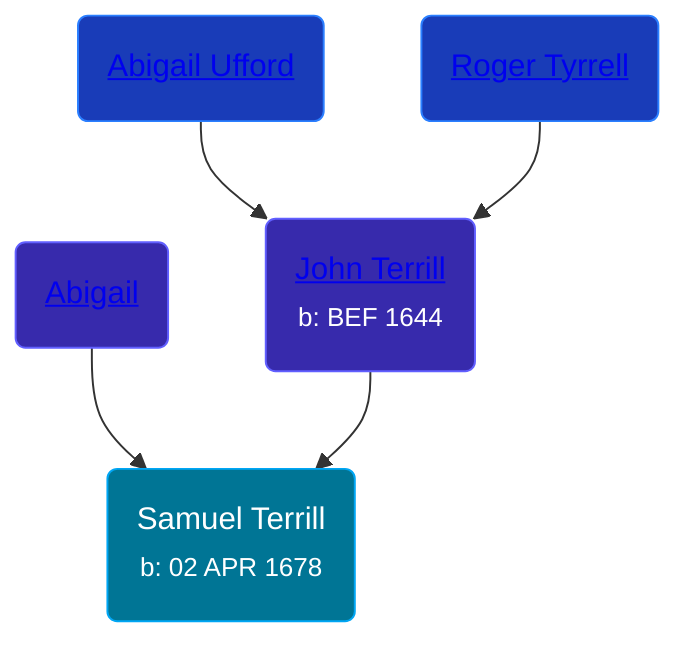

## 🔵 Samuel Terrill
<small>Age: 71y, 7m, 28d</small>

Son of [John Terrill](/people/6/65221157) and [Abigail ](/people/4/48582652)





### 📆 Events


Type | Date | Age at Event | Place
------ | ------ | ------ | ------
[Birth](#event-event-2) | 02 APR 1678 |  | Milford, Connecticut, USA
[Death](#event-event-3) | 1750 | 71y, 7m, 28d | Milford, Connecticut, USA



- **[Birth](#event-event-2)**
**Date**: 02 APR 1678, Age:
**Place**: Milford, Connecticut, USA
- **[Death](#event-event-3)**
**Date**: 1750, Age: 71y, 7m, 28d
**Place**: Milford, Connecticut, USA


### 📰 Event Sources

####  Birth, 02 APR 1678
* Roger and Abigail (Ufford) Terrill and Some Descendants: 1632 - 1993  - 10

####  Death, 1750
* Roger and Abigail (Ufford) Terrill and Some Descendants: 1632 - 1993  - 20