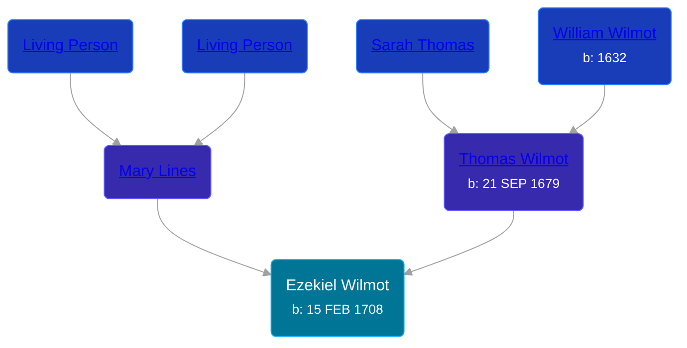

## 🔵 Ezekiel Wilmot

Son of [Thomas Wilmot](/people/3/36930663) and [Mary Lines](/people/1/19292651)





### 📆 Events


Type | Date | Age at Event | Place
------ | ------ | ------ | ------
[Birth](#event-event-2) | 15 FEB 1708 |  |



- **[Birth](#event-event-2)**
**Date**: 15 FEB 1708, Age:
**Place**:


### 📰 Event Sources

####  Birth, 15 FEB 1708
* The New England Historical and Genealogical Register  - 71