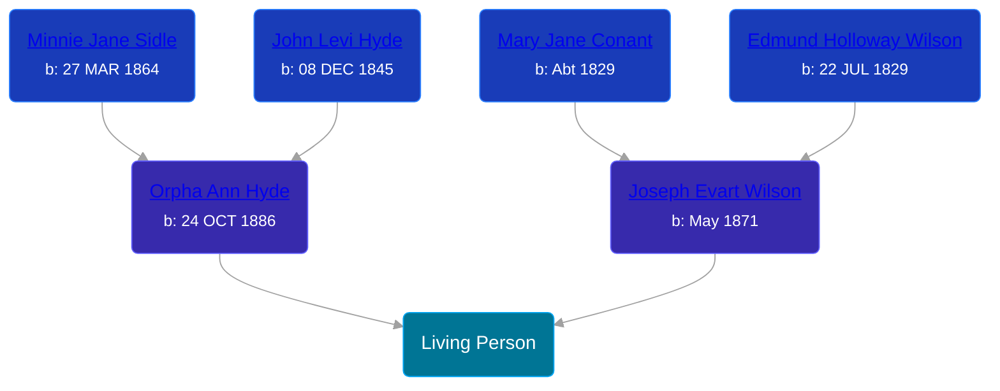

## 🟣 Living Person

Daughter of [Joseph Evart Wilson](/people/5/57306025) and [Orpha Ann Hyde](/people/6/63932813)





## 👩‍❤️‍👨 Relationships

### 🔵 [Living Person](/people/5/56910550)

### 🔵 [George Andrew Cree](/people/1/19357156), b. 09 SEP 1917

#### Children With George Andrew Cree
* 🔵 [Living Person](/people/7/74673901)
* 🔵 [Living Person](/people/6/60999639)