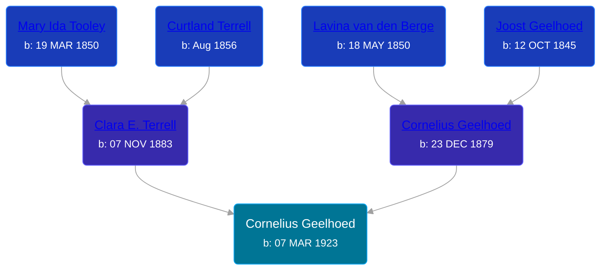

## 🔵 Cornelius Geelhoed
<small>Age: 77y, 9m, 18d</small>

Son of [Cornelius Geelhoed](/people/9/92844960) and [Clara E. Terrell](/people/6/62490094)





### 📆 Events


Type | Date | Age at Event | Place
------ | ------ | ------ | ------
Birth | 07 MAR 1923 |  |
[Residence](#event-event-0) | 1930 | 6y, 8m, 23d | Cascade, Kent, Michigan, USA
[Death](#event-event-4) | 25 DEC 2000 | 77y, 9m, 18d | Lowell, Kent, Michigan, USA
[Burial](#event-event-5) | 28 DEC 2000 | 77y, 9m, 21d | Alton Cemetery, Lowell, Kent, Michigan, USA



- **Birth**
**Date**: 07 MAR 1923, Age:
**Place**:
- **[Residence](#event-event-0)**
**Date**: 1930, Age: 6y, 8m, 23d
**Place**: Cascade, Kent, Michigan, USA
- **[Death](#event-event-4)**
**Date**: 25 DEC 2000, Age: 77y, 9m, 18d
**Place**: Lowell, Kent, Michigan, USA
- **[Burial](#event-event-5)**
**Date**: 28 DEC 2000, Age: 77y, 9m, 21d
**Place**: Alton Cemetery, Lowell, Kent, Michigan, USA


### 📰 Event Sources

####  Residence, 1930
* 1930 US Census

####  Death, 25 DEC 2000
* U.S., Social Security Death Index, 1935-2014
>   
  > Name: CORNELIUS GEELHOED  
  > Birth: 07 Mar 1923  
  > Death: 25 Dec 2000 (V)  
  > Last Residence: 49331 (Lowell, Kent, MI)  
  > Last Benefit: (none specified)  
  > SSN: ###-##-####  
  > Issued: Michigan
* The Grand Rapids Press  - 27 Dec 2000
>   
  > GEELHOED -- Cornelius Geelhoed, aged 77, of Lowell, passed away Monday, December 25. He is survived by his wife of 51 years, Phyllis; sons, Marc Geelhoed of Lowell, Dennis (Laura) Geelhoed of Rockford; special grandchildren, Karlie, Jason, and Samantha; three sisters, Katherine Fox and Ella Thompson, both of Lowell; brother Raymond (Lorene) Geelhoed of Lowell; sister-in-law, Margaret Geelhoed; grand-newphew, Samuel Laase of Lowell; several nieces and newphews. Funeral services will be held on Thursday at 3:30 PM at the Roth-Gerst Funeral Home, 305 N. Hudson, Lowell, with Pastor Brian Bosscher officiating. Interment in Alton Cemetery.

####  Burial, 28 DEC 2000
* U.S. Veterans Gravesites, ca.1775-2006
>   
  > Name:  Cornelius J Geelhoed  
  > Service Info.: PFC US ARMY WORLD WAR II  
  > Birth Date: 6 Mar 1923  
  > Death Date: 25 Dec 2000  
  > Cemetery: Alton Cemetery  
  > Cemetery Address: Lowell, MI 49331
