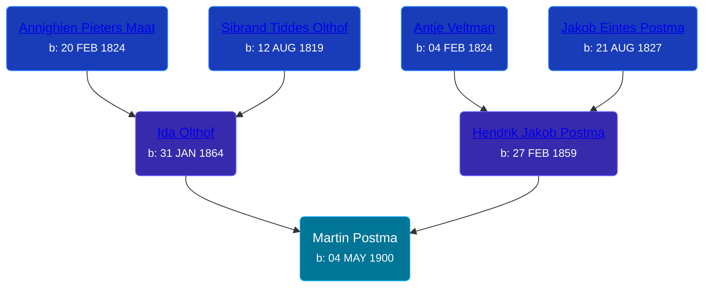

## 🔵 Martin Postma
<small>Age: 65y, 10m, 6d</small>

Son of [Hendrik Jakob Postma](/people/3/31727152) and [Ida Olthof](/people/6/60020862)





### 📆 Events


Type | Date | Age at Event | Place
------ | ------ | ------ | ------
[Birth](#event-event-2) | 04 MAY 1900 |  | Dutton, Kent, Michigan, USA
[Residence](#event-event-0) | 29 JUN 1900 | 1m, 25d | Gaines Township, Kent, Michigan, USA
[Residence](#event-event-1) | 1910 | 9y, 6m, 26d | Gaines Township, Kent, Michigan, USA
[Residence](#event-event-2) | 14 JAN 1920 | 19y, 8m, 10d | Gaines Township, Kent, Michigan, USA
[Residence](#event-event-3) | 21 APR 1930 | 29y, 11m, 17d | Paris Township, Kent, Michigan, USA
[Residence](#event-event-4) | 17 APR 1950 | 49y, 11m, 13d | Gaines Township, Kent, Michigan, USA
[Death](#event-event-8) | 10 MAR 1966 | 65y, 10m, 6d | Grand Rapids, Kent, Michigan, United States
Burial | 14 MAR 1966 | 65y, 10m, 10d | Pine Hill Cemetery, Kentwood, Kent, Michigan, USA



- **[Birth](#event-event-2)**
**Date**: 04 MAY 1900, Age:
**Place**: Dutton, Kent, Michigan, USA
- **[Residence](#event-event-0)**
**Date**: 29 JUN 1900, Age: 1m, 25d
**Place**: Gaines Township, Kent, Michigan, USA
- **[Residence](#event-event-1)**
**Date**: 1910, Age: 9y, 6m, 26d
**Place**: Gaines Township, Kent, Michigan, USA
- **[Residence](#event-event-2)**
**Date**: 14 JAN 1920, Age: 19y, 8m, 10d
**Place**: Gaines Township, Kent, Michigan, USA
- **[Residence](#event-event-3)**
**Date**: 21 APR 1930, Age: 29y, 11m, 17d
**Place**: Paris Township, Kent, Michigan, USA
- **[Residence](#event-event-4)**
**Date**: 17 APR 1950, Age: 49y, 11m, 13d
**Place**: Gaines Township, Kent, Michigan, USA
- **[Death](#event-event-8)**
**Date**: 10 MAR 1966, Age: 65y, 10m, 6d
**Place**: Grand Rapids, Kent, Michigan, United States
- **Burial**
**Date**: 14 MAR 1966, Age: 65y, 10m, 10d
**Place**: Pine Hill Cemetery, Kentwood, Kent, Michigan, USA


## 👩‍❤️‍👨 Relationships

### 🟣 [Ida Mary Geelhoed](/people/1/11612484), b. 18 DEC 1907

#### Events


Type | Date | Age at Event | Place
------ | ------ | ------ | ------
[Marriage](#event-family-0-event-0) | 11 FEB 1926 | 25y, 9m, 7d | Grand Rapids, Kent, Michigan, United States



- **[Marriage](#event-family-0-event-0)**
**Date**: 11 FEB 1926, Age: 25y, 9m, 7d
**Place**: Grand Rapids, Kent, Michigan, United States


#### Children With Ida Mary Geelhoed
* 🟣 [Ida Clara Postma](/people/5/59695695), b. 27 NOV 1926
* 🟣 [Leona Irene Postma](/people/9/94687680), b. 12 OCT 1928
* 🔵 [Henry Cornelius Postma](/people/2/26394076), b. 15 MAR 1930
* 🔵 [Living Person](/people/9/94856714)
* 🔵 [Robert J Postma](/people/9/97112614), b. 19 APR 1933
* 🔵 [Living Person](/people/4/42765268)
* 🔵 [Living Person](/people/5/50440830)
* 🔵 [Living Person](/people/9/99000592)
* 🟣 [Martha Arlene Postma](/people/3/39368292), b. 18 FEB 1944
### 📰 Event Sources

####  Birth, 04 MAY 1900
* Michigan, U.S., Birth Records, 1867-1914
>   
  > Name: Mart Postma  
  > Gender: Male  
  > Race: White  
  > Birth Date: 4 May 1900  
  > Birth Place: Gaines Tp., Michigan, USA  
  > Father: Henry Postma  
  > Mother: Ida Postma  
  > Jurisdiction Number: 18834  
  > Reference Number: 82  
  >

####  Residence, 29 JUN 1900
* 1900 US Census
>   
  > Name: Mart Postma  
  > Sex: Male  
  > Age: 0  
  > Birth Date: May 1900  
  > Birthplace: Michigan  
  > Marital Status: Single  
  > Race: White  
  > Relationship to Head of Household: Son  
  > Father's Birthplace: Holland  
  > Mother's Birthplace: Holland  
  > Event Type: Census  
  > Event Date: 1900  
  > Event Place: Gaines Township, Kent, Michigan, United States  
  > Line Number: 15  
  > Sheet Letter: A  
  > Sheet Number: 13

####  Residence, 1910
* 1910 US Census

####  Residence, 14 JAN 1920
* 1920 US Census
>   
  > Name: Martin Postma  
  > Sex: Male  
  > Age: 19  
  > Birth Year (Estimated): 1901  
  > Birthplace: Michigan  
  > Marital Status: Single  
  > Race: White  
  > Relationship to Head of Household: Son  
  > Father's Birthplace: Holland  
  > Mother's Birthplace: Holland  
  > Event Type: Census  
  > Event Date: 1920  
  > Event Place: Gaines Township, Kent, Michigan, United States  
  > Event Place (Original): Gaines, ED 13, Kent, Michigan, United States  
  > Household Identifier: 127  
  > Line Number: 72  
  > Sheet Letter: B  
  > Sheet Number: 7  
  >   
  > In household:  
  > Henry Postma, Father, 60, Holland  
  > Ida Postma, Mother, 56, Holland  
  > Jacob Postma, Brother, 23, Michigan  
  > Peter Postma, Brother, 21, Michigan  
  > Theo Postma, Brother, 17, Michigan  
  > Dewey Postma, Brother, 15, Michigan  
  > Clara Postma, Sister, 13, Michigan  
  > Charles Postma, Brother, 10, Michigan

####  Marriage, 11 FEB 1926
* Michigan, Marriage Records, 1867-1952
>   
  > Name: Mr Martin Postma  
  > Gender: Male  
  > Race: White  
  > Birth Year: abt 1901  
  > Birth Place: Dutton, Michigan  
  > Marriage Date: 11 Feb 1926  
  > Marriage Place: Grand Rapids, Kent, Michigan, USA  
  > License County: Kent  
  > Age: 25  
  > Residence Place: Grand Rapids  
  > Father: Henry Postma  
  > Mother: Ida Olthof  
  > Spouse: Ida Coolhood  
  > Spouse Gender: Female  
  > Spouse Race: White  
  > Spouse Age: 18  
  > Spouse Birth Place: Paris Twp Kent Co  
  > Spouse Residence Place: Grand Rapids  
  > Spouse Father: Cornelius Coolhood  
  > Spouse Mother: Clara Terrel  
  > County File Number: 6049  
  > State File Number: 41 195  
  > Film: 109  
  > Film Title: 41 Kent 2750  
  > Film Description: Kalkaska (1937) - Kent (1927)
* Kent County Marriage Records  - Book 22, Page 11, Record 6049
>   
  > Date of Record: 5 Feb 1926  
  > Date of Marriage: 11 Feb 1926  
  > Groom: Martin Postma  
  > Bride: Ida Geelhoed  
  > Groom Birthplace: Dutton, Paris, Kent County, Michigan  
  > Groom's Parents: Henry Postma and Ida Olthof  
  > Groom's Prev. Marriages: 0  
  > Bride Birthplace: Kent County  
  > Bride's Parents: Cornelius Geelhoed and Clara Terrell  
  > Bride's Prev. Marriages: 0

####  Residence, 21 APR 1930
* 1930 US Census
>   
  > Name: Martin Postma  
  > Birth Year: abt 1901  
  > Gender: Male  
  > Race: White  
  > Age in 1930: 29  
  > Birthplace: Michigan  
  > Marital Status: Married  
  > Relation to Head of House: Head  
  > Home in 1930: Paris, Kent, Michigan, USA  
  > Street Address: Janet Street  
  > House Number: 352  
  > Dwelling Number: 443  
  > Family Number: 443  
  > Home Owned or Rented: Rented  
  > Home Value: 25  
  > Radio Set: No  
  > Lives on Farm: No  
  > Age at First Marriage: 26  
  > Attended School: No  
  > Able to Read and Write: Yes  
  > Father's Birthplace: Netherlands  
  > Mother's Birthplace: Netherlands  
  > Able to Speak English: Yes  
  > Occupation: Truck driver  
  > Industry: Road-constructor  
  > Class of Worker: Wage or salary worker  
  > Employment: No  
  >   
  > Household members:  
  > Martin Postma, 29, Head  
  > Ida M Postma, 22, Wife  
  > Ida C Postma, 3, Daughter  
  > Leona I Postma, 1, Daughter  
  > Henry C Postma, 0, Son  
  >

####  Residence, 17 APR 1950
* 1950 US Census
>   
  > Name: Martin Postma  
  > Age: 49  
  > Birth Date: abt 1901  
  > Gender: Male  
  > Race: White  
  > Birth Place: Michigan  
  > Marital Status: Married  
  > Relation to Head of House: Head  
  > Residence Date: 1950  
  > Home in 1950: Gaines, Kent, Michigan, USA  
  > Street Name: 60th Street  
  > Apartment Number: 2864  
  > Dwelling Number: 271  
  > Farm: Yes  
  > Questionnaire Number: 124  
  > Occupation: Truck Driver  
  > Industry: Kent Co Read Com  
  > Occupation Category: Wk  
  > Hours Worked: 54  
  > Worker Class: Government  
  >   
  > Household members:  
  > Martin Postma, 49, Head  
  > Ida Postma, 42, Wife  
  > Leona Postma, 21, Daughter  
  > Martin Postma Jr, 18, Son  
  > Kenneth Postma, 14, Son  
  > David Postma, 10, Son  
  > Joseph Postma, 7, Son  
  > Martha Postma, 6, Daughter  
  > Henry Postma, 90, Father  
  >

####  Death, 10 MAR 1966
* U.S., Social Security Death Index, 1935-2014
>   
  > Name: MARTIN POSTMA  
  > Birth: 04 May 1900  
  > Death: Mar 1966  
  > Last Residence: 49508 (Grand Rapids, Kent, MI)  
  > Last Benefit: (none specified)  
  > SSN: ###-##-####  
  > Issued: Michigan
* The Grand Rapids Herald  - 11 Mar 1966
>   
  > POSTMA -- Martin Postma Sr., aged 65, of 786 68th St. SE, passed away unexpectedly Thursday evening at his residence. He is survived by his wife, Ida, two daughters, Mrs. Edward (Ida) Bowyer, Mrs. Duane (Martha) Wilson, five sons, Henry C., Martin J., Kenneth D., and David L., Joseph Postma and one son-in-law, Norman Hall; 29 grandchildren; four brothers, Sibrant, Jacob, Peter, Charles Postma; two sisters, Mrs. Richard Weaver and Mrs. William Slager, all of the Grand Rapids area. Funeral services will be held Monday at 2 p.m. in the Good News Baptist Church, 68th St. and Eastern Ave., with Rev. Edwin A. DuBois officiating. Interment Pine Hill Cemetery.