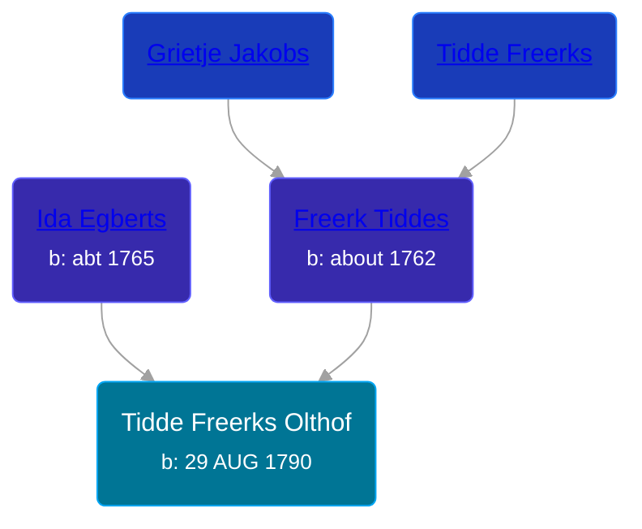

## 🔵 Tidde Freerks Olthof

Son of [Freerk Tiddes](/people/2/21111317) and [Ida Egberts](/people/6/68075578)





### 📆 Events


Type | Date | Age at Event | Place
------ | ------ | ------ | ------
[Birth](#event-event-2) | 29 AUG 1790 |  | Loppersum, Netherlands



- **[Birth](#event-event-2)**
**Date**: 29 AUG 1790, Age:
**Place**: Loppersum, Netherlands


## 👩‍❤️‍👨 Relationships

### 🟣 [Aalke Pieters](/people/7/70796984), b. 12 APR 1789

#### Events


Type | Date | Age at Event | Place
------ | ------ | ------ | ------
[Marriage](#event-family-0-event-0) | 17 SEP 1813 | 23y, 18d | Loppersum, Netherlands



- **[Marriage](#event-family-0-event-0)**
**Date**: 17 SEP 1813, Age: 23y, 18d
**Place**: Loppersum, Netherlands


#### Children With Aalke Pieters
* 🟣 [Living Person](/people/9/94260080)
* 🔵 [Living Person](/people/5/56284680)
* 🔵 [Living Person](/people/4/41071798)
* 🔵 [Freerk Tidde Olthof](/people/1/17887459), b. abt 1817
* 🔵 [Sibrand Tiddes Olthof](/people/7/76433820), b. 12 AUG 1819
* 🔵 [Hindrik Tiddes Olthof](/people/5/57682588), b. 29 OCT 1822
### 🟣 [Trientje Lubbertus Kolhek](/people/4/42737119), b. abt 1803

#### Events


Type | Date | Age at Event | Place
------ | ------ | ------ | ------
Marriage | 1844 | 53y, 3m, 1d |



- **Marriage**
**Date**: 1844, Age: 53y, 3m, 1d
**Place**:


### 📰 Event Sources

####  Birth, 29 AUG 1790
* Dutch Civil Register
>   
  > Info obtained from marriage record with Aalke
####  Marriage, 17 SEP 1813
* Dutch Civil Register
>   
  > Groom: Tidde Freerks  
  > Profession (Groom): boerenknecht (Farmhand)  
  > Birth date (Groom): 29-08-1790  
  > Place of birth (Groom): Loppersum  
  > Age (Groom): 23 jaar  
  >   
  > Bride: Aaltie Pieters  
  > Profession (Bride): Dienstmeid (maid)  
  > Birth date (Bride): 12-04-1789  
  > Place of birth (Bride): Loppersum  
  > Age (Bride): 24 jaar  
  >   
  > Father of the groom: Freerk Tiddes  
  > Profession (Father of the groom): arbeider (worker)  
  >   
  > Mother of the groom: IJda Egberts  
  > Profession (Mother of the groom): Arbeidster (worker)  
  > Father of the bride: Pieter Jans  
  > Profession (Father of the bride): korenschipper (corn skipper)  
  >   
  > Mother of the bride: Boutie Sibrandts  
  >   
  > Event: Huwelijk (Wedding)  
  > Event date: 17-09-1813  
  > Event place: Loppersum  
  >   
  > Document type: BS Huwelijk  
  > Heritage institution: Groninger Archieven  
  > Institution place: Groningen  
  > Collection region: Groningen  
  > Sourcenumber: 15  
  > Registration date: 17-09-1813  
  > Document place: Loppersum  
  > Collection: Bron: boek, Periode: 1813  
  > Book: Huwelijksregister 1813  
  > AkteSoort: huwelijk  
  >

####  Marriage, 1844
