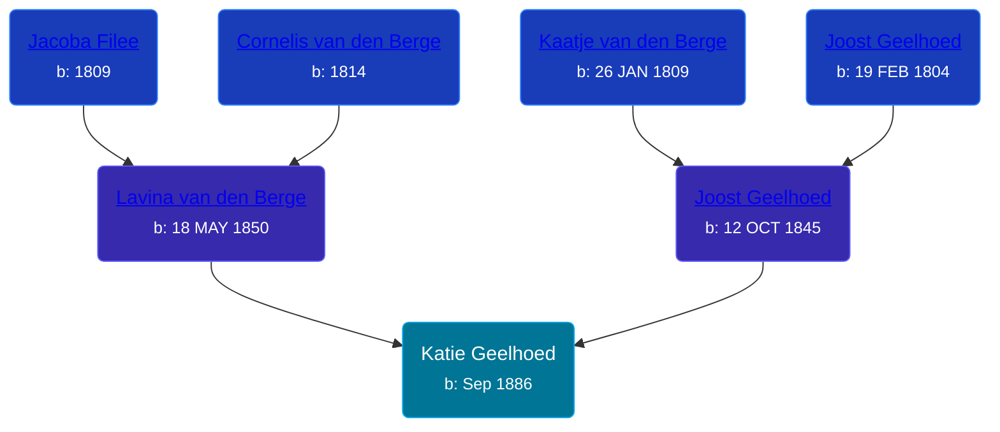

## 🟣 Katie Geelhoed

Daughter of [Joost Geelhoed](/people/7/73673934) and [Lavina van den Berge](/people/7/71558365)





### 📆 Events


Type | Date | Age at Event | Place
------ | ------ | ------ | ------
[Birth](#event-event-2) | Sep 1886 |  | Michigan, USA



- **[Birth](#event-event-2)**
**Date**: Sep 1886, Age:
**Place**: Michigan, USA


### 📰 Event Sources

####  Birth, Sep 1886
* Geelhoet, Geelhoed & Geelhoedt Genealogie  - 142