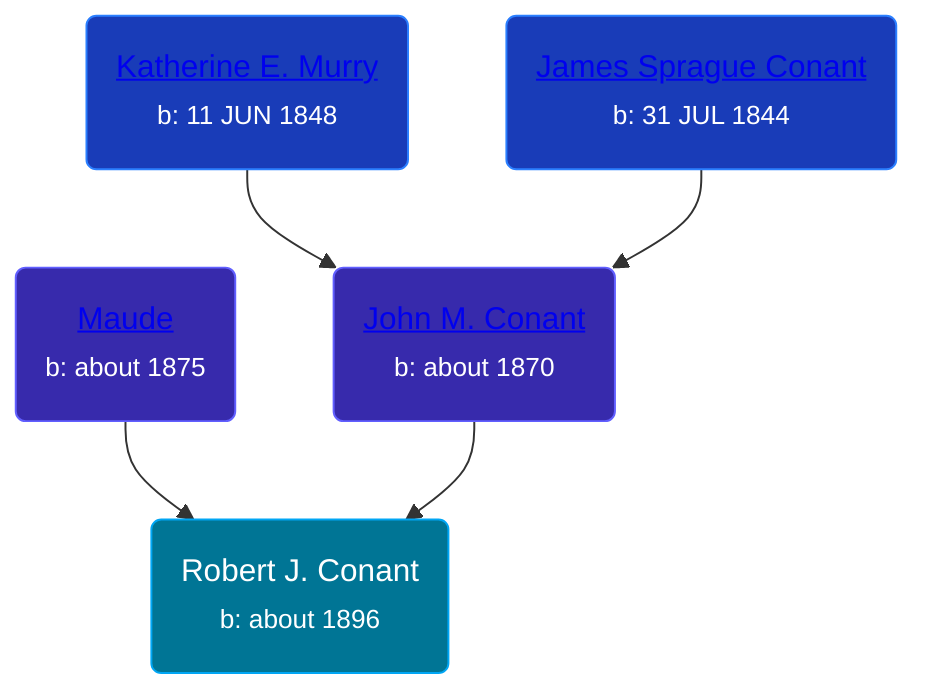

## 🔵 Robert J. Conant

Son of [John M. Conant](/people/3/38989658) and [Maude ](/people/5/58402932)





### 📆 Events


Type | Date | Age at Event | Place
------ | ------ | ------ | ------
Birth | about 1896 |  | Michigan, USA
[Residence](#event-event-0) | 1910 | 14y | Robinson Township, Ottawa, Michigan, USA
[Residence](#event-event-1) | 1920 | 24y | Robinson Township, Ottawa, Michigan, USA



- **Birth**
**Date**: about 1896, Age:
**Place**: Michigan, USA
- **[Residence](#event-event-0)**
**Date**: 1910, Age: 14y
**Place**: Robinson Township, Ottawa, Michigan, USA
- **[Residence](#event-event-1)**
**Date**: 1920, Age: 24y
**Place**: Robinson Township, Ottawa, Michigan, USA


## 👩‍❤️‍👨 Relationships

### 🟣 [Living Person](/people/7/73409066)

#### Children With Living Person
* 🔵 [Living Person](/people/3/38299190)
### 📰 Event Sources

####  Residence, 1910
* 1910 US Census

####  Residence, 1920
* 1920 US Census
