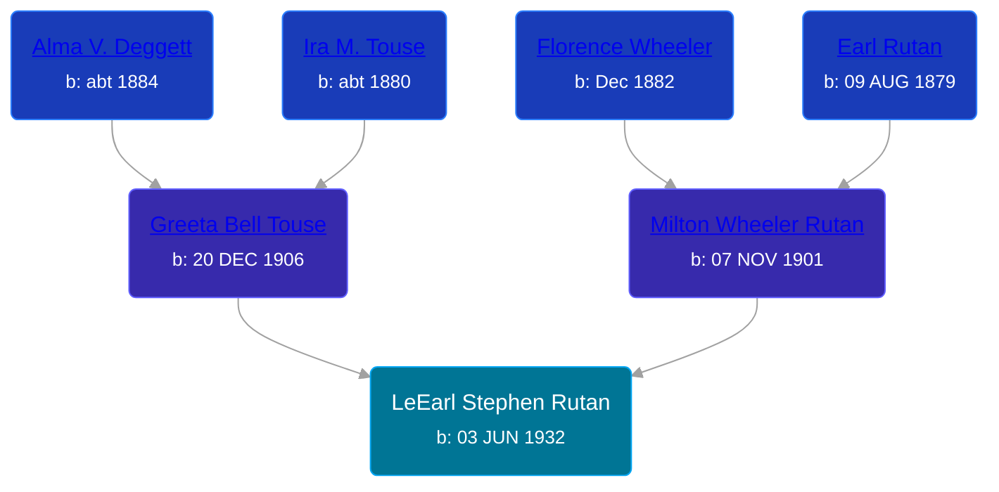

## 🔵 LeEarl Stephen Rutan
<small>Age: 89y, 7m, 1d</small>

Son of [Milton Wheeler Rutan](/people/2/20825556) and [Greeta Bell Touse](/people/6/61135838)



```mermaid
graph
classDef grands fill:#193cb8,stroke:#2b7fff,stroke-width:1px,color:#fff;
classDef parents fill:#372aac,stroke:#615fff,stroke-width:1px,color:#fff;
classDef primary fill:#007595,stroke:#00a6f4,stroke-width:1px,color:#fff;
75225835(LeEarl Stephen Rutan<br /><small>b: 03 JUN 1932</small>):::primary
61135838(<a class="text-white" href="/people/6/61135838">Greeta Bell Touse</a><br /><small>b: 20 DEC 1906</small>):::parents-->75225835
42271632(<a class="text-white" href="/people/4/42271632">Alma V. Deggett</a><br /><small>b: abt 1884</small>):::grands-->61135838
43588740(<a class="text-white" href="/people/4/43588740">Ira M. Touse</a><br /><small>b: abt 1880</small>):::grands-->61135838
20825556(<a class="text-white" href="/people/2/20825556">Milton Wheeler Rutan</a><br /><small>b: 07 NOV 1901</small>):::parents-->75225835
48964520(<a class="text-white" href="/people/4/48964520">Florence Wheeler</a><br /><small>b: Dec 1882</small>):::grands-->20825556
29949376(<a class="text-white" href="/people/2/29949376">Earl Rutan</a><br /><small>b: 09 AUG 1879</small>):::grands-->20825556
linkStyle default stroke:#a1a1a1
```


### 📆 Events


Type | Date | Age at Event | Place
------ | ------ | ------ | ------
Birth | 03 JUN 1932 |  | Jackson, Jackson, Michigan, USA
[Residence](#event-event-1) | 10 APR 1940 | 7y, 10m, 7d | Napolean, Jackson, Michigan, USA
[Residence](#event-event-2) | 04 MAY 1950 | 17y, 11m, 1d | Columbia, Jackson, Michigan, USA
[Death](#event-event-3) | 04 JAN 2022 | 89y, 7m, 1d | Jackson, Jackson, Michigan, USA



- **Birth**
**Date**: 03 JUN 1932, Age:
**Place**: Jackson, Jackson, Michigan, USA
- **[Residence](#event-event-1)**
**Date**: 10 APR 1940, Age: 7y, 10m, 7d
**Place**: Napolean, Jackson, Michigan, USA
- **[Residence](#event-event-2)**
**Date**: 04 MAY 1950, Age: 17y, 11m, 1d
**Place**: Columbia, Jackson, Michigan, USA
- **[Death](#event-event-3)**
**Date**: 04 JAN 2022, Age: 89y, 7m, 1d
**Place**: Jackson, Jackson, Michigan, USA


## 👩‍❤️‍👨 Relationships

### 🟣 [Living Person](/people/2/27090454)

### 📰 Event Sources

####  Residence, 10 APR 1940
* 1940 US Census
>
  > Name: Leearl S Rutan
  > Age: 7
  > Estimated Birth Year: abt 1933
  > Gender: Male
  > Race: White
  > Birthplace: Michigan
  > Marital Status: Single
  > Relation to Head of House: Grandson
  > Home in 1940: Napoleon, Jackson, Michigan
  > Street: Cranbering Lake Road
  > Inferred Residence in 1935: Rural
  > Residence in 1935: Rural
  > Sheet Number: 6A
  > Attended School or College: Yes
  > Highest Grade Completed: Elementary school, 1st grade
  >
  > Household Members
  > Ira M Touse, 60, Head
  > Alma V Touse, 56, Wife
  > Milton W Rutan, 38, Son-in-law
  > Grata D Rutan, 33, Daughter
  > Paul R Rutan, 12, Grandson
  > Louis W Rutan, 11, Grandson
  > L Earl S Rutan, 7, Grandson
  > Florence J Rutan, 5, Granddaughter
  > Gayl A Rutan, 3, Granddaughter
  > Mary L Rutan, 1, Granddaughter

####  Residence, 04 MAY 1950
* 1950 US Census
>
  > Name: Le Earl S Rutan
  > Age: 17
  > Birth Date: 1933
  > Gender: Male
  > Race: White
  > Birth Place: Michigan
  > Marital Status: Never Married (Single)
  > Relation to Head of House: Son
  > Residence Date: 1950
  > Home in 1950: Columbia, Jackson, Michigan, USA
  > Street Name: Reed Rd
  > House Number: 4497
  > Dwelling Number: 475
  > Farm: Yes
  > Questionnaire Number: 165
  > Inferred Previous Residence Place: Columbia, Jackson, Michigan
  > Occupation: Farm Hand
  > Industry: Farm
  > Father Birth Place: USA
  > Mother Birth Place: USA
  > Occupation Category: Working
  > Hours Worked: 35
  > Worker Class: Private
  > Same House: Yes
  > School Completed: S11
  > Grade Completed: No
  > School Attendance: Yes
  > Weeks Worked: 0
  > Income: none
  > Other Income: 0
  > Supplemental Income: 0
  >
  > Household members:
  > Milton W. Rutan, 48, Head
  > Greeta B. Rutan, 42, Wife
  > Paul R. Rutan, 22, Son
  > LeEarl S. Rutan, 17, Son
  > Florence J. Rutan, 15, Daughter
  > Gayle A. Rutan, 13, Daughter
  > Mary L. Rutan, 11, Daughter
  > Milton Rutan Jr, 6, Son
  > Bruce W. Rutan, 2, Son
  > Alice May Rutan, Feb 1950, Daughter
  >

####  Death, 04 JAN 2022
* Lauer Family Funeral Homes
>
  > LeEarl “Trapper” Stephen Rutan, passed away peacefully on January 4, 2022 at Henry Ford Allegiance Hospital, surrounded by his loving family. He was born in Jackson, Michigan on June 3, 1932 to parents Milton and Greeta Rutan.
  >
  > He is preceded in death by his parents; daughter, Colleen Rutan; son, Gavin Rutan; brothers, Paul Rutan, Louie Rutan, and Bruce Rutan.
  >
  > He is survived by his loving wife of 26 years, Doris; daughters, Heather Rutan and Maureen Brandon; sons, Lee Rutan and Stephen (Lena) Rutan; step-sons, Charles (Pam) Coleman, Randy (Rhonda) Coleman, and Terry (Barbara) Coleman; sisters, Gail Gamble, Alice Hill, Florence Johnson, and MaryLou Hammer ; brother, Milt (Kathy) Rutan; several grandchildren, great-grandchildren, great-great-grandchildren, nieces and nephews.
  >
  > Lee was known as a mechanic both at work and at home. He had a knack for working on cars, tractors, and anything with an engine. He retired after 36 years as a maintenance mechanic at Aeroquip/ Eaton Corp and throughout his life continually managed his farm.
  >
  > He was always known as a family man who loved his dogs. Getting together for family events and holidays which always put a smile on his face. He also was an outdoorsman and enjoyed spending time out with nature, even doing some hunting earlier in his life. For the last 20 years, he and his wife made the decision to become snowbirds and headed to Florida each winter to get some sun and escape the cold Michigan winters.
  >
  > According to his wishes, cremation has taken place. The family will receive friends for a visitation on Monday, January 17, 2022  from 10:00 AM until the time of a Celebration of Life at 11:00 AM at the First Church of the Nazarene, 3905 Clinton Rd, Jackson, MI 49201.
