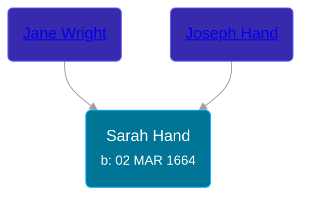

## 🟣 Sarah Hand
<small>Age: 87y, 4m, 29d</small>

Daughter of [Joseph Hand](/people/9/92413984) and [Jane Wright](/people/2/25627400)





### 📆 Events


Type | Date | Age at Event | Place
------ | ------ | ------ | ------
[Birth](#event-event-3) | 02 MAR 1664 |  | Guilford, Connecticut, USA
[Death](#event-event-4) | 01 AUG 1751 | 87y, 4m, 29d |



- **[Birth](#event-event-3)**
**Date**: 02 MAR 1664, Age:
**Place**: Guilford, Connecticut, USA
- **[Death](#event-event-4)**
**Date**: 01 AUG 1751, Age: 87y, 4m, 29d
**Place**:


## 👩‍❤️‍👨 Relationships

### 🔵 [Samuel Munger](/people/5/57362828), b. abt 1665

#### Events


Type | Date | Age at Event | Place
------ | ------ | ------ | ------
[Marriage](#event-family-0-event-0) | 11 OCT 1688 | 24y, 7m, 9d | Guilford, Connecticut, USA



- **[Marriage](#event-family-0-event-0)**
**Date**: 11 OCT 1688, Age: 24y, 7m, 9d
**Place**: Guilford, Connecticut, USA


#### Children With Samuel Munger
* 🔵 [Samuel Munger](/people/6/64239804), b. 07 FEB 1690
* 🔵 [Joseph Munger](/people/8/82274524), b. 19 JAN 1693
* 🟣 [Sarah Munger](/people/2/24642538), b. 16 MAR 1695
* 🟣 [Deliverence Munger](/people/1/16376581), b. 12 MAR 1697
* 🔵 [Nathaniel Munger](/people/9/90245281), b. 26 FEB 1699
* 🔵 [James Munger](/people/7/73707528), b. 01 MAY 1701
* 🟣 [Ann Munger](/people/6/68439647), b. 01 FEB 1703
* 🟣 [Jane Munger](/people/1/1929334), b. 27 FEB 1705
### 📰 Event Sources

####  Birth, 02 MAR 1664
* Families of Early Guilford, Connecticut, Vol. II  - 833
* The Munger Book  - 203

####  Marriage, 11 OCT 1688
* Families of Early Guilford, Connecticut, Vol. II  - 833
* The Munger Book  - 203
####  Death, 01 AUG 1751
* Families of Early Guilford, Connecticut, Vol. II  - 833
* The Munger Book  - 203
