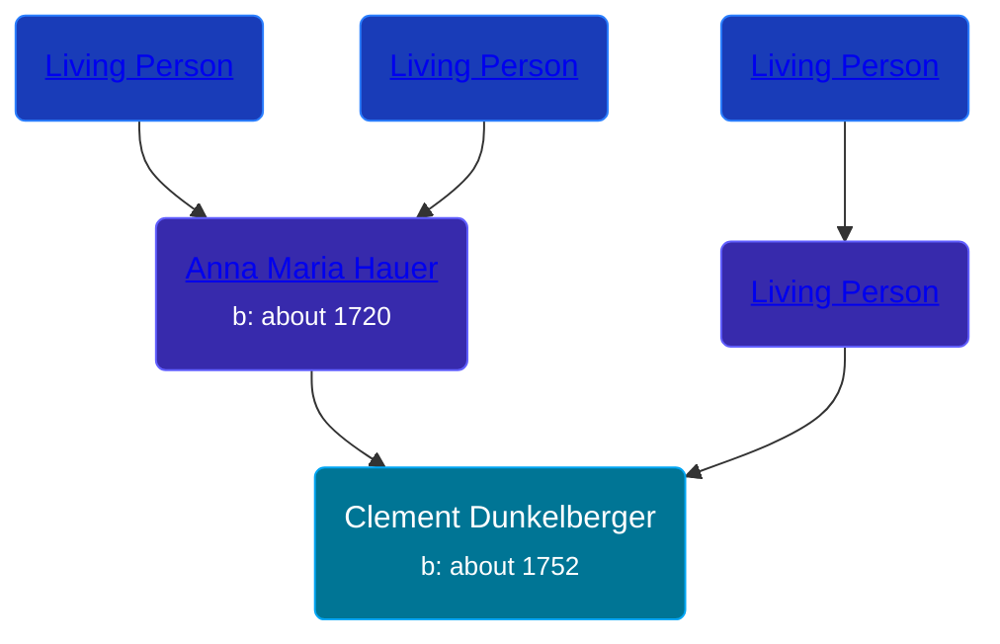

## 🔵 Clement Dunkelberger
<small>Age: 49y</small>

Son of [Living Person](/people/1/13545057) and [Anna Maria Hauer](/people/2/22963774)





### 📆 Events


Type | Date | Age at Event | Place
------ | ------ | ------ | ------
[Birth](#event-event-2) | about 1752 |  |
[Death](#event-event-3) | about 1801 | 49y |



- **[Birth](#event-event-2)**
**Date**: about 1752, Age:
**Place**:
- **[Death](#event-event-3)**
**Date**: about 1801, Age: 49y
**Place**:


## 👩‍❤️‍👨 Relationships

### 🟣 [Anna Maria Gurtner](/people/8/86382016), b. Jan 1752

### 📰 Event Sources

####  Birth, about 1752
* The Dunkelberger Family: Europe to America, 1600-1982

####  Death, about 1801
* The Dunkelberger Family: Europe to America, 1600-1982