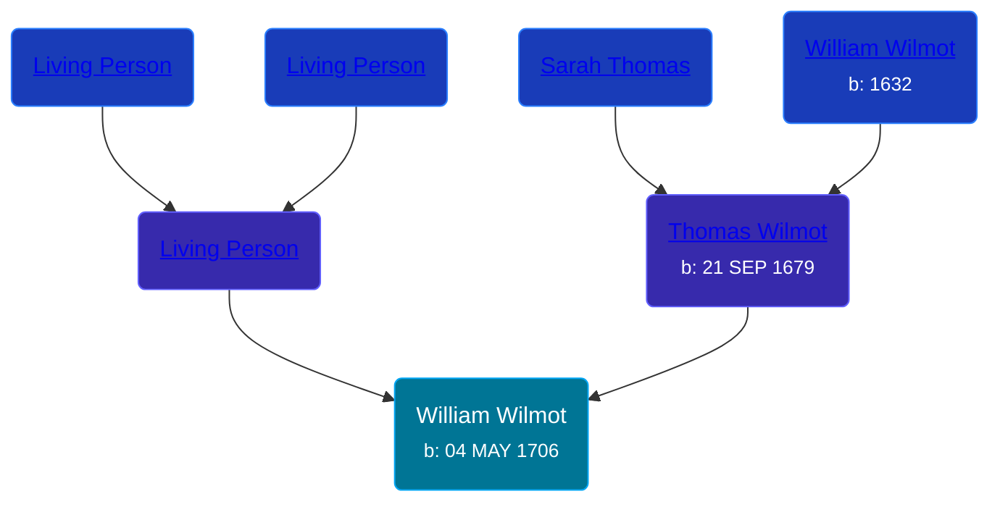

## 🔵 William Wilmot

Son of [Thomas Wilmot](/people/3/36930663) and [Living Person](/people/1/19292651)





### 📆 Events


Type | Date | Age at Event | Place
------ | ------ | ------ | ------
[Birth](#event-event-2) | 04 MAY 1706 |  |



- **[Birth](#event-event-2)**
**Date**: 04 MAY 1706, Age:
**Place**:


### 📰 Event Sources

####  Birth, 04 MAY 1706
* The New England Historical and Genealogical Register  - 71