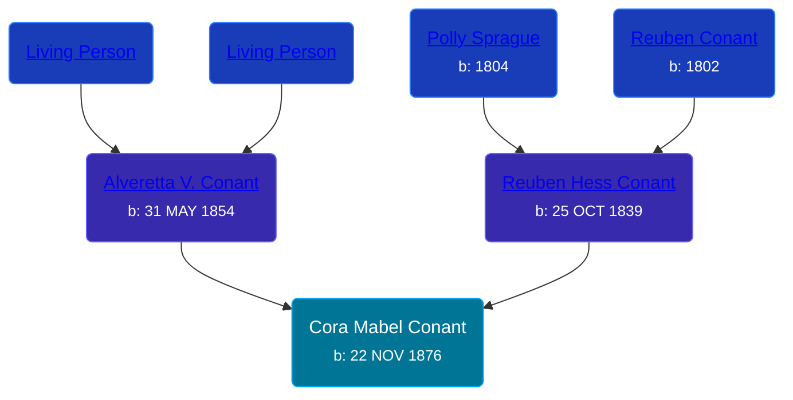

## 🟣 Cora Mabel Conant
<small>Age: 48y, 1m, 17d</small>

Daughter of [Reuben Hess Conant](/people/3/37326838) and [Alveretta V. Conant](/people/6/60109856)





### 📆 Events


Type | Date | Age at Event | Place
------ | ------ | ------ | ------
Birth | 22 NOV 1876 |  | Robinson Township, Ottawa, Michigan, USA
[Residence](#event-event-0) | June 1880 | 3y, 6m, 8d | Robinson Township, Ottawa, Michigan, USA
[Residence](#event-event-1) | 05 JUN 1900 | 23y, 6m, 13d | Robinson Township, Ottawa, Michigan, USA
[Death](#event-event-5) | 09 JAN 1925 | 48y, 1m, 17d | Grand Haven, Ottawa, Michigan, USA



- **Birth**
**Date**: 22 NOV 1876, Age:
**Place**: Robinson Township, Ottawa, Michigan, USA
- **[Residence](#event-event-0)**
**Date**: June 1880, Age: 3y, 6m, 8d
**Place**: Robinson Township, Ottawa, Michigan, USA
- **[Residence](#event-event-1)**
**Date**: 05 JUN 1900, Age: 23y, 6m, 13d
**Place**: Robinson Township, Ottawa, Michigan, USA
- **[Death](#event-event-5)**
**Date**: 09 JAN 1925, Age: 48y, 1m, 17d
**Place**: Grand Haven, Ottawa, Michigan, USA


### 📰 Event Sources

####  Residence, June 1880
* 1880 US Census

####  Residence, 05 JUN 1900
* 1900 US Census

####  Death, 09 JAN 1925
* Michigan, Death Records, 1867-1950
>   
  > Name:Cora Mabel Bartow  
  > [Cora Mabel Conant]   
  > Gender:Female  
  > Race:White  
  > Marital status:Married  
  > Death Age:48  
  > Birth Date:22 Nov 1876  
  > Birth Place:Robinson Twp, Michigan  
  > Death Date:9 Jan 1925  
  > Death Place:Grand Haven, Ottawa, Michigan, USA  
  > File Number:000329  
  > Father:Ruben H Conant  
  > Mother:Albertta Conant
