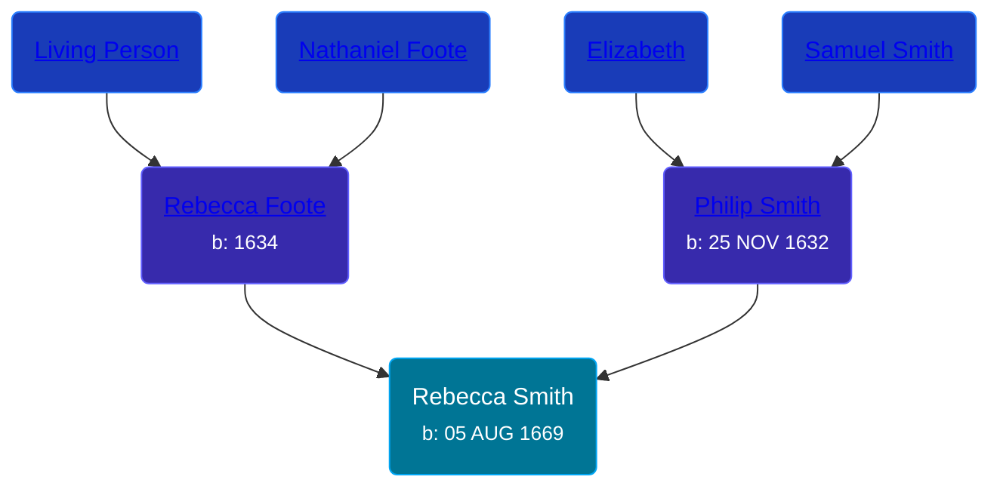

## 🟣 Rebecca Smith
<small>Age: 81y, 2m, 2d</small>

Daughter of [Philip Smith](/people/6/61981014) and [Rebecca Foote](/people/3/32470572)





### 📆 Events


Type | Date | Age at Event | Place
------ | ------ | ------ | ------
[Birth](#event-event-3) | 05 AUG 1669 |  | Wethersfield, Connecticut, USA
[Death](#event-event-4) | 07 OCT 1750 | 81y, 2m, 2d | Wethersfield, Connecticut, USA



- **[Birth](#event-event-3)**
**Date**: 05 AUG 1669, Age:
**Place**: Wethersfield, Connecticut, USA
- **[Death](#event-event-4)**
**Date**: 07 OCT 1750, Age: 81y, 2m, 2d
**Place**: Wethersfield, Connecticut, USA


## 👩‍❤️‍👨 Relationships

### 🔵 [George Stillman](/people/6/67040632), b. 1654

#### Events


Type | Date | Age at Event | Place
------ | ------ | ------ | ------
[Marriage](#event-family-0-event-0) | 1686 | 16y, 3m, 25d |



- **[Marriage](#event-family-0-event-0)**
**Date**: 1686, Age: 16y, 3m, 25d
**Place**:


#### Children With George Stillman
* 🔵 [George Stillman](/people/8/81770674), b. 1686
* 🟣 [Rebecca Stillman](/people/6/66249241), b. 14 JAN 1688
* 🟣 [Mary Stillman](/people/3/39239663), b. 12 JUL 1689
* 🔵 [Nathaniel Stillman](/people/3/32494149), b. 01 JUL 1691
* 🔵 [John Stillman](/people/3/30853088), b. 19 FEB 1693
* 🟣 [Sarah Stillman](/people/9/9722974), b. 28 DEC 1694
* 🟣 [Martha Stillman](/people/9/90081792), b. 28 NOV 1696
* 🟣 [Anna Stillman](/people/2/20562156), b. 06 APR 1699
* 🟣 [Elizabeth Stillman](/people/9/91912725), b. 19 OCT 1700
* 🟣 [Hannah Stillman](/people/3/31820970), b. 07 NOV 1702
* 🟣 [Lydia Stillman](/people/7/71541832), b. 07 NOV 1702
* 🔵 [Benjamin Stillman](/people/3/38355828), b. 29 JUL 1705
### 📰 Event Sources

####  Birth, 05 AUG 1669
* Wethersfield Inscriptions  - 114
* The Foote Family: or the Descendants of Nathaniel Foote  - 277
* Ancestry of George W. Bush

####  Marriage, 1686
* The Foote Family: or the Descendants of Nathaniel Foote  - 279
####  Death, 07 OCT 1750
* Ancestry of George W. Bush
* Wethersfield Inscriptions  - 114
* The Foote Family: or the Descendants of Nathaniel Foote  - 279
