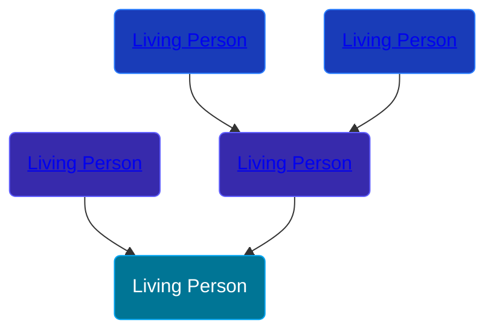

## 🟣 Living Person

Daughter of [Living Person](/people/2/29247616) and [Living Person](/people/9/93135357)



```mermaid
graph
classDef grands fill:#193cb8,stroke:#2b7fff,stroke-width:1px,color:#fff;
classDef parents fill:#372aac,stroke:#615fff,stroke-width:1px,color:#fff;
classDef primary fill:#007595,stroke:#00a6f4,stroke-width:1px,color:#fff;
76243458(Living Person):::primary
93135357(<a class="text-white" href="/people/9/93135357">Living Person</a>):::parents-->76243458
29247616(<a class="text-white" href="/people/2/29247616">Living Person</a>):::parents-->76243458
68623568(<a class="text-white" href="/people/6/68623568">Living Person</a>):::grands-->29247616
46067436(<a class="text-white" href="/people/4/46067436">Living Person</a>):::grands-->29247616
```

