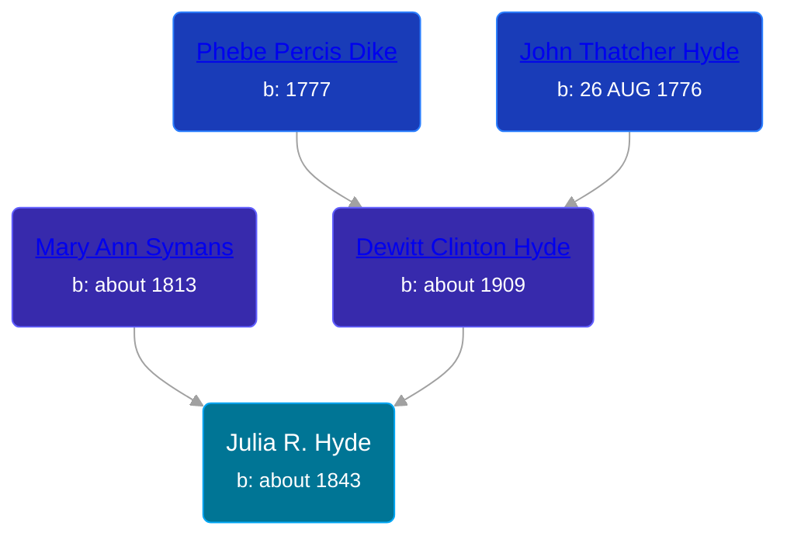

## 🟣 Julia R. Hyde

Daughter of [Dewitt Clinton Hyde](/people/4/47530864) and [Mary Ann Symans](/people/4/4704808)





### 📆 Events


Type | Date | Age at Event | Place
------ | ------ | ------ | ------
Birth | about 1843 |  | New York, USA
[Residence](#event-event-0) | 15 NOV 1850 | 7y, 11m, 15d | Angelica, Allegany, New York, USA
[Residence](#event-event-1) | June 1855 | 12y, 6m | Amity, Allegany, New York, USA



- **Birth**
**Date**: about 1843, Age:
**Place**: New York, USA
- **[Residence](#event-event-0)**
**Date**: 15 NOV 1850, Age: 7y, 11m, 15d
**Place**: Angelica, Allegany, New York, USA
- **[Residence](#event-event-1)**
**Date**: June 1855, Age: 12y, 6m
**Place**: Amity, Allegany, New York, USA


### 📰 Event Sources

####  Residence, 15 NOV 1850
* 1850 US Census

####  Residence, June 1855
* 1855 New York State Census
