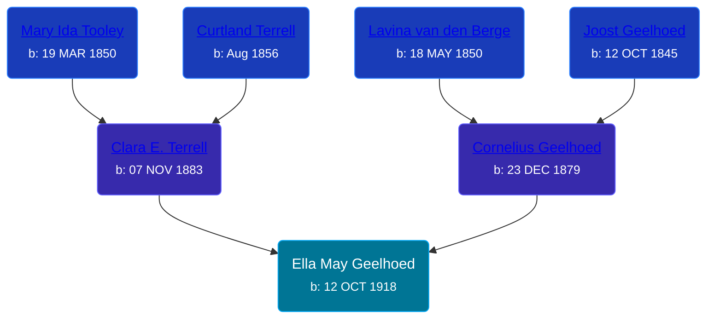

## 🟣 Ella May Geelhoed
<small>Age: 98y, 11m, 2d</small>

Daughter of [Cornelius Geelhoed](/people/9/92844960) and [Clara E. Terrell](/people/6/62490094)





### 📆 Events


Type | Date | Age at Event | Place
------ | ------ | ------ | ------
Birth | 12 OCT 1918 |  |
[Residence](#event-event-0) | 1920 | 1y, 1m, 18d | Paris Township, Kent, Michigan, USA
[Residence](#event-event-1) | 1930 | 11y, 1m, 18d | Cascade, Kent, Michigan, USA
[Death](#event-event-5) | 14 SEP 2017 | 98y, 11m, 2d |
[Burial](#event-event-6) |  |  | Oakwood Cemetery, Lowell, Kent, Michigan, USA



- **Birth**
**Date**: 12 OCT 1918, Age:
**Place**:
- **[Residence](#event-event-0)**
**Date**: 1920, Age: 1y, 1m, 18d
**Place**: Paris Township, Kent, Michigan, USA
- **[Residence](#event-event-1)**
**Date**: 1930, Age: 11y, 1m, 18d
**Place**: Cascade, Kent, Michigan, USA
- **[Death](#event-event-5)**
**Date**: 14 SEP 2017, Age: 98y, 11m, 2d
**Place**:
- **[Burial](#event-event-6)**
**Date**:
**Place**: Oakwood Cemetery, Lowell, Kent, Michigan, USA


### 📰 Event Sources

####  Residence, 1920
* 1920 US Census

####  Residence, 1930
* 1930 US Census

####  Death, 14 SEP 2017
* The Grand Rapids Press
>   
  > Thompson, Ella M. Age 98 of Lowell, was born on October 12, 1918, and passed away peacefully Thursday, September 14, 2017. She was preceded in death by her parents, Cornelius and Clara Geelhoed; 7 siblings; husband LeRoy; sons Jerry, Jim and Jack; son-in-laws David Fluger and Robert Lucas. Ella will be deeply missed by daughter, Joanne (David Miller) Lucas; daughter-in-laws Helen (John) Fowler, Peg Thompson, and Sharon Thompson; grandchildren Sandy (Risty) Hall, Jerry "Jay" (Janice) Thompson, Lori (Mike) Kibler, Allen Thompson, Linda (Farley) McCaul, LuAnn (David) LaFontsee, Amy (Mike) Richardson, Kyle (Kristin) Thompson, Brian (Sarah) Thompson, Suzette (Mark) Verbeck, Kathy (Kevin) Wallace, Michelle (Coy) Reynolds; 23 great-grandchildren; 8 great-great-grandchildren; many nieces and nephews; extended family Charlie, Amanda, Dawson, and Delany Miller; special long-time friends, Ella Aspinall, Bill Fluger; and many others. Ella enjoyed bowling, gardening, playing cards, the Detroit Tigers, camping, fishing, and baking pies. Visitation will be Sunday, September 17, 4:00-7:00 p.m. at Roth-Gerst Chapel, 305 N. Hudson, Lowell. Funeral service will be Monday, September 18, 11:00 a.m. at Lowell United Methodist Church, 621 E. Main St., Lowell, with visitation one hour prior to the service. Rev. Brad Brillhart officiating. Interment Oakwood Cemetery. Memorial contributions may be made to Flat River Outreach Ministries, 11535 Fulton St. E, Lowell, MI 49331; or Hospice of Michigan, 989 Spaulding Ave. SE, Ada, MI 49301.

####  Burial
* findagrave.com
