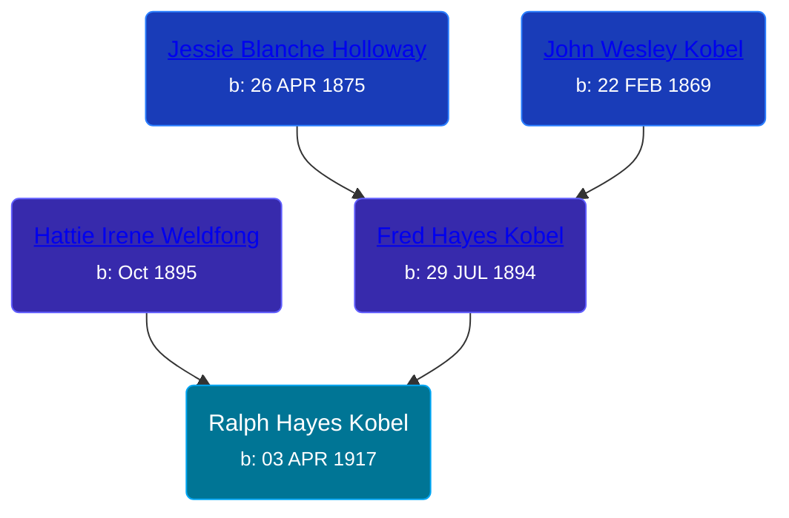

## 🔵 Ralph Hayes Kobel
<small>Age: 2y, 9m</small>

Son of [Fred Hayes Kobel](/people/1/1672312) and [Hattie Irene Weldfong](/people/5/59131944)





### 📆 Events


Type | Date | Age at Event | Place
------ | ------ | ------ | ------
[Birth](#event-event-2) | 03 APR 1917 |  | Michigan, USA
[Death](#event-event-3) | 03 JAN 1920 | 2y, 9m | Otsego, Michigan, USA



- **[Birth](#event-event-2)**
**Date**: 03 APR 1917, Age:
**Place**: Michigan, USA
- **[Death](#event-event-3)**
**Date**: 03 JAN 1920, Age: 2y, 9m
**Place**: Otsego, Michigan, USA


### 📰 Event Sources

####  Birth, 03 APR 1917
* Ron Wilson's Research

####  Death, 03 JAN 1920
* Ron Wilson's Research