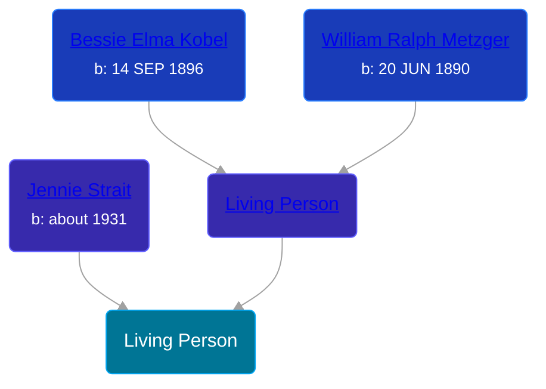

## 🔵 Living Person

Son of [Living Person](/people/2/25349238) and [Jennie Strait](/people/6/6678780)





## 👩‍❤️‍👨 Relationships

### 🟣 [Living Person](/people/2/20979328)

#### Children With Living Person
* 🔵 [Living Person](/people/4/40255380)