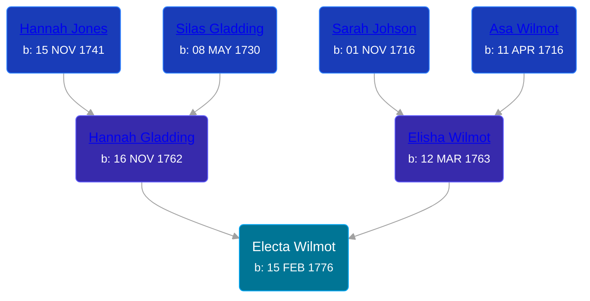

## 🟣 Electa Wilmot
<small>Age: 85y, 9m, 7d</small>

Daughter of [Elisha Wilmot](/people/2/21177328) and [Hannah Gladding](/people/8/88055086)





### 📆 Events


Type | Date | Age at Event | Place
------ | ------ | ------ | ------
[Birth](#event-event-3) | 15 FEB 1776 |  | Connecticut, USA
[Residence](#event-event-0) | 1840 | 63y, 9m, 15d | Ridgeville, Lorain, Ohio, USA
[Residence](#event-event-1) | Jun 1860 | 84y, 3m, 15d | Ridgeville, Lorain, Ohio, USA
Death | 22 NOV 1861 | 85y, 9m, 7d | Ridgeville, Lorain, Ohio, USA
[Burial](#event-event-7) |  |  | Ridgeville Cemetery, Ridgeville, Lorain, Ohio, USA



- **[Birth](#event-event-3)**
**Date**: 15 FEB 1776, Age:
**Place**: Connecticut, USA
- **[Residence](#event-event-0)**
**Date**: 1840, Age: 63y, 9m, 15d
**Place**: Ridgeville, Lorain, Ohio, USA
- **[Residence](#event-event-1)**
**Date**: Jun 1860, Age: 84y, 3m, 15d
**Place**: Ridgeville, Lorain, Ohio, USA
- **Death**
**Date**: 22 NOV 1861, Age: 85y, 9m, 7d
**Place**: Ridgeville, Lorain, Ohio, USA
- **[Burial](#event-event-7)**
**Date**:
**Place**: Ridgeville Cemetery, Ridgeville, Lorain, Ohio, USA


## 👩‍❤️‍👨 Relationships

### 🔵 [Tillotson S. Terrell](/people/2/25548435), b. 01 MAY 1785

#### Events


Type | Date | Age at Event | Place
------ | ------ | ------ | ------
[Marriage](#event-family-0-event-0) | 1804 | 27y, 9m, 15d | Waterbury, New Haven, Connecticut, USA



- **[Marriage](#event-family-0-event-0)**
**Date**: 1804, Age: 27y, 9m, 15d
**Place**: Waterbury, New Haven, Connecticut, USA


#### Children With Tillotson S. Terrell
* 🔵 [Horatio Terrell](/people/7/74880220), b. 14 NOV 1805
* 🔵 [Eliza Terrell](/people/1/14584373), b. 12 SEP 1807
* 🔵 [Alonzo Philorman Terrell](/people/1/16020599), b. 05 SEP 1809
* 🟣 [Lucinda Terrell](/people/9/94352489), b. 19 DEC 1812
* 🔵 [Andrew Jackson Terrell](/people/1/15331189), b. 01 MAR 1815
* 🟣 [Ester Terrell](/people/2/27094826), b. 05 SEP 1816
* 🟣 [Harriet Terrell](/people/4/44975736), b. 09 JUL 1818
* 🔵 [Tillotson T. Terrell](/people/5/59687792), b. 04 MAR 1821
* 🔵 [Marcus Terrell](/people/2/231106), b. 05 JUN 1822
* 🟣 [Paulina Terrell](/people/1/17012140), b. 30 JUN 1823
* 🔵 [Lovinus Terrell](/people/8/80690232), b. 04 DEC 1824
### 📰 Event Sources

####  Birth, 15 FEB 1776
* The Town and City of Waterbury, Connecticut  - 135

####  Residence, 1840
* 1840 US Census

####  Residence, Jun 1860
* 1860 US Census

####  Burial
* Ridgeville Cemetery
>   
  > TERRELL  
  > Tillotson, Waterbury CT May 1, 1775 or (85)-Dec 23, 1838 War 1812  
  > Electa WILMONT, wife, Feb 15, 1776-Nov 22, 1861

####  Marriage, 1804
* Genealogy: A Journal of American Ancestry