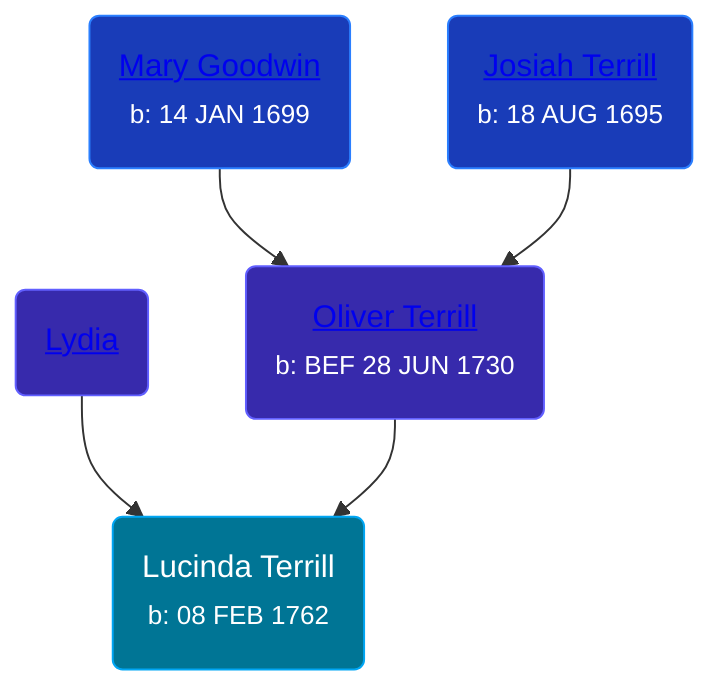

## 🟣 Lucinda Terrill
<small>Age: 65y, 6m, 22d</small>

Daughter of [Oliver Terrill](/people/9/94505283) and [Lydia ](/people/1/18213296)





### 📆 Events


Type | Date | Age at Event | Place
------ | ------ | ------ | ------
[Birth](#event-event-2) | 08 FEB 1762 |  | Waterbury, New Haven, Connecticut, USA
[Death](#event-event-3) | SEP 1827 | 65y, 6m, 22d |



- **[Birth](#event-event-2)**
**Date**: 08 FEB 1762, Age:
**Place**: Waterbury, New Haven, Connecticut, USA
- **[Death](#event-event-3)**
**Date**: SEP 1827, Age: 65y, 6m, 22d
**Place**:


### 📰 Event Sources

####  Birth, 08 FEB 1762
* The Town and City of Waterbury, Connecticut  - 136
* Roger and Abigail (Ufford) Terrill and Some Descendants: 1632 - 1993  - 36,73

####  Death, SEP 1827
* Roger and Abigail (Ufford) Terrill and Some Descendants: 1632 - 1993  - 73