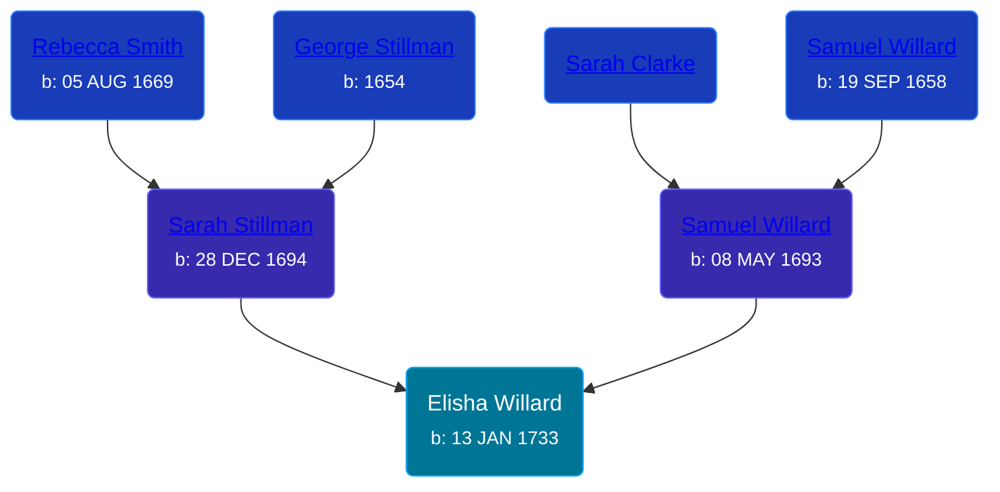

## 🔵 Elisha Willard
<small>Age: 1m, 9d</small>

Son of [Samuel Willard](/people/1/12362566) and [Sarah Stillman](/people/9/9722974)





### 📆 Events


Type | Date | Age at Event | Place
------ | ------ | ------ | ------
[Birth](#event-event-2) | 13 JAN 1733 |  |
[Death](#event-event-3) | 22 FEB 1733 | 1m, 9d |



- **[Birth](#event-event-2)**
**Date**: 13 JAN 1733, Age:
**Place**:
- **[Death](#event-event-3)**
**Date**: 22 FEB 1733, Age: 1m, 9d
**Place**:


### 📰 Event Sources

####  Birth, 13 JAN 1733
* The Foote Family: or the Descendants of Nathaniel Foote  - 283

####  Death, 22 FEB 1733
* The Foote Family: or the Descendants of Nathaniel Foote  - 283