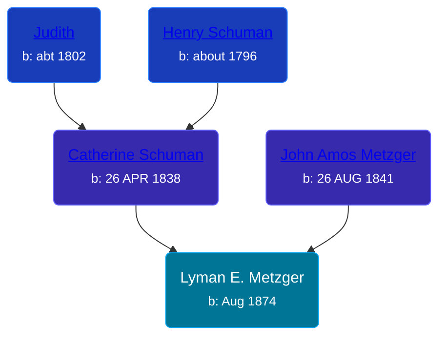

## 🔵 Lyman E. Metzger

Son of [John Amos Metzger](/people/2/28893894) and [Catherine Schuman](/people/3/39599940)





### 📆 Events


Type | Date | Age at Event | Place
------ | ------ | ------ | ------
Birth | Aug 1874 |  | Indiana, USA
[Residence](#event-event-0) | 1880 | 5y, 4m | Richland, Whitley, Indiana, USA
[Residence](#event-event-1) | 1900 | 25y, 4m | Pleasant Township, Wabash, Indiana, USA
[Residence](#event-event-2) | 1920 | 45y, 4m | Pleasant Township, Wabash, Indiana, USA



- **Birth**
**Date**: Aug 1874, Age:
**Place**: Indiana, USA
- **[Residence](#event-event-0)**
**Date**: 1880, Age: 5y, 4m
**Place**: Richland, Whitley, Indiana, USA
- **[Residence](#event-event-1)**
**Date**: 1900, Age: 25y, 4m
**Place**: Pleasant Township, Wabash, Indiana, USA
- **[Residence](#event-event-2)**
**Date**: 1920, Age: 45y, 4m
**Place**: Pleasant Township, Wabash, Indiana, USA


## 👩‍❤️‍👨 Relationships

### 🟣 [Maggie E. Vance](/people/9/93797650), b. Aug 1878

#### Children With Maggie E. Vance
* 🔵 [George V. Metzger](/people/2/27843040), b. 23 MAY 1896
### 📰 Event Sources

####  Residence, 1880
* 1880 US Census

####  Residence, 1900
* 1900 US Census

####  Residence, 1920
* 1920 US Census
