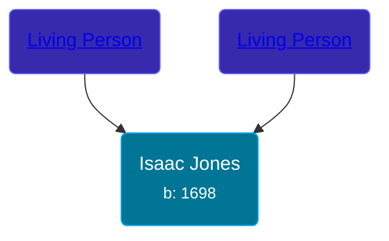

## 🔵 Isaac Jones

Son of [Living Person](/people/7/74416956) and [Living Person](/people/1/1648568)





### 📆 Events


Type | Date | Age at Event | Place
------ | ------ | ------ | ------
[Birth](#event-event-2) | 1698 |  | New Haven, New Haven, Connecticut, USA



- **[Birth](#event-event-2)**
**Date**: 1698, Age:
**Place**: New Haven, New Haven, Connecticut, USA


### 📰 Event Sources

####  Birth, 1698
* The New England Historical and Genealogical Register  - 310