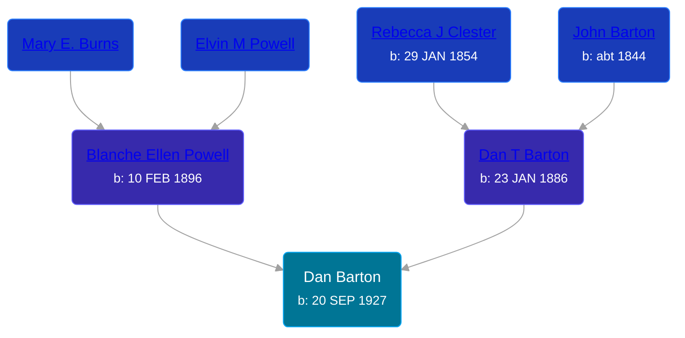

## 🔵 Dan Barton
<small>Age: 37y, 13d</small>

Son of [Dan T Barton](/people/9/95106328) and [Blanche Ellen Powell](/people/8/88023024)





### 📆 Events


Type | Date | Age at Event | Place
------ | ------ | ------ | ------
Birth | 20 SEP 1927 |  | Michigan, USA
[Residence](#event-event-1) | 23 APR 1930 | 2y, 7m, 3d | Tompkins Township, Jackson, Michigan, USA
[Residence](#event-event-2) | 1935 | 7y, 2m, 10d | Tompkins Township, Jackson, Michigan, USA
[Residence](#event-event-3) | 15 APR 1940 | 12y, 6m, 25d | Tompkins Township, Jackson, Michigan, USA
[Residence](#event-event-4) | 05 APR 1950 | 22y, 6m, 15d | Blackman, Jackson, Michigan, USA
[Death](#event-event-5) | 03 OCT 1964 | 37y, 13d | Adrian, Bates, Missouri, USA



- **Birth**
**Date**: 20 SEP 1927, Age:
**Place**: Michigan, USA
- **[Residence](#event-event-1)**
**Date**: 23 APR 1930, Age: 2y, 7m, 3d
**Place**: Tompkins Township, Jackson, Michigan, USA
- **[Residence](#event-event-2)**
**Date**: 1935, Age: 7y, 2m, 10d
**Place**: Tompkins Township, Jackson, Michigan, USA
- **[Residence](#event-event-3)**
**Date**: 15 APR 1940, Age: 12y, 6m, 25d
**Place**: Tompkins Township, Jackson, Michigan, USA
- **[Residence](#event-event-4)**
**Date**: 05 APR 1950, Age: 22y, 6m, 15d
**Place**: Blackman, Jackson, Michigan, USA
- **[Death](#event-event-5)**
**Date**: 03 OCT 1964, Age: 37y, 13d
**Place**: Adrian, Bates, Missouri, USA


## 👩‍❤️‍👨 Relationships

### 🟣 [Living Person](/people/5/54802016)

#### Children With Living Person
* 🔵 [Living Person](/people/6/68347050)
### 📰 Event Sources

####  Residence, 23 APR 1930
* 1930 US Census
>
  > Name: Junior D Barton
  > Sex: Male
  > Age: 2 years
  > Birth Year (Estimated): 1928
  > Birthplace: Michigan
  > Marital Status: Single
  > Race: White
  > Relationship to Head of Household: Son
  > Father's Birthplace: Kansas
  > Mother's Birthplace: Iowa
  > Event Type: Census
  > Event Date: 1930
  > Event Place: Tompkins, Jackson, Michigan, United States
  > Event Place (Original): Tompkins, Jackson, Michigan, United States
  > Line Number: 23
  > Sheet Letter: A
  > Sheet Number: 9
  >
  > Dan Barton, Head, 45, Kansas
  > Blanche E Barton, Wife F 34, Iowa
  > Harry W Barton, Son, 11, Iowa
  > Elvin C Barton, Son, 10, Iowa
  > Jean L Barton, Daughter F 9, Iowa
  > Doris, Barton, Daughter F 6, Iowa
  > Junior D Barton, Son, 2, Michigan
  >

####  Residence, 1935
* 1940 US Census

####  Residence, 15 APR 1940
* 1940 US Census
>
  > Name: Dan Barton Jr [Don Barton Jr]
  > Age: 12
  > Estimated Birth Year: abt 1928
  > Gender: Male
  > Race: White
  > Birthplace: Michigan
  > Marital Status: Single
  > Relation to Head of House: Son
  > Home in 1940: Tompkins, Jackson, Michigan
  > Map of Home in 1940:
  > Inferred Residence in 1935: Tompkins, Jackson, Michigan
  > Residence in 1935: Tompkins
  > Sheet Number: 7B
  > Attended School or College: Yes
  > Highest Grade Completed: Elementary school, 5th grade
  >
  > Household members
  > Dan Barton, 55
  > Blanche Barton, 44
  > Harry Barton, 29
  > Alvin Barton, 20
  > Doris Barton, 16
  > Dan Barton, 12
  > Anna Barton, 8
  >

####  Residence, 05 APR 1950
* 1950 US Census
>
  > Name: Dan Barton Jr
  > Age: 22
  > Birth Date: abt 1928
  > Gender: Male
  > Race: White
  > Birth Place: Michigan
  > Marital Status: Married
  > Relation to Head of House: Head
  > Residence Date: 1950
  > Home in 1950: Blackman, Jackson, Michigan, USA
  > Street Name: Mc Gill
  > House Number: 1920
  > Apartment Number: Uidets Rd
  > Dwelling Number: 80
  > Farm: No
  > Acres: Yes
  > Questionnaire Number: 19
  > Occupation: Laborer
  > Industry: Grocery Supplies
  > Occupation Category: Working
  > Hours Worked: 45
  > Worker Class: Private
  >
  > Household Members
  > Dan Barton Jr, 22, Head
  > Lillie V Barton, 20, Wife
  > Jerry M Barton, 17, Son
  > Ed Densmore, 60, Lodger
  > Clifford De Forest, 24, Lodger
  >

####  Death, 03 OCT 1964
* Missouri, U.S., Death Certificates, 1910-1971
>
  > State File Number: 0039135
  >
  > Registration District No.: 27
  > Primary Registration District No.: 4031
  > Registrar's No.: (illegible)
  >
  > Place of Death
  >   County: Bates
  >   City or Town: Adrian
  >   Full Name of Hospital or Institution: (blank)
  >   Length of Stay: 23 Months
  >
  > Usual Residence
  >   State: Missouri
  >   County: Bates
  >   City or Town: Adrian
  >   Street Address: (blank)
  >   Inside City Limits: Yes
  >   Resided on Farm: No
  >
  > Name of Deceased: Dan Barton Jr.
  > Sex: Male
  > Color or Race: White
  > Marital Status: Married
  >
  > Date of Death: October 23, 1964
  > Date of Birth: September 20, 1927
  > Age: 37
  >
  > Usual Occupation: Laborer
  > Kind of Business or Industry: (blank)
  >
  > Birthplace: Jackson Co., Michigan
  > Citizen of What Country: U.S.A.
  >
  > Father's Name: Dan Barton
  > Mother's Maiden Name: Blanche E. Powell
  >
  > Name of Husband or Wife: Lillie Viola Barton
  >
  > Was Deceased Ever in U.S. Armed Forces?: Unknown
  >
  > Social Security No.: 365-26-1817
  >
  > Informant: Lillie V. Barton
  > Informant Address: Adrian, Mo.
  >
  > Cause of Death
  >   Immediate Cause: Self-inflicted gun-shot wound to head
  >   Due to (b): (blank)
  >   Due to (c): (blank)
  >
  > Other Significant Conditions Contributing to Death: (blank)
  >
  > Autopsy Performed: No
  >
  > Manner of Death: Suicide
  >
  > Describe How Injury Occurred: Self-inflicted gun-shot wound—head.
  >
  > Time of Injury: 11 a.m.
  >
  > Date of Injury: October 23, 1964
  >
  > Injury Occurred While at Work: No
  >
  > Place of Injury: Home
  >
  > City/Town or Location of Injury: Adrian
  >
  > County of Injury: Bates
  >
  > State of Injury: Missouri
  >
  > Attended Deceased From: (blank)
  > To: (blank)
  >
  > Last Seen Alive: About 11 p.m.
  >
  > Signature: Douglas (surname illegible)
  > Degree or Title: Coroner
  >
  > Coroner Address: Butler, Mo.
  >
  > Date Signed: October 23, 1964
  >
  > Disposition of Body: Burial
  >
  > Date of Burial: October 26, 1964
  >
  > Name of Cemetery: Crescent Hill Cemetery
  >
  > Location of Cemetery: Adrian, Mo.
  >
  > Funeral Director: Six Funeral Service
  >
  > Funeral Director Address: Adrian, Mo.
  >
  > Date Received by Local Registrar: October 26, 1964
  >
  > Registrar's Signature: Tommy Jean Wilson
  >
  > (image transcribed by AI)

