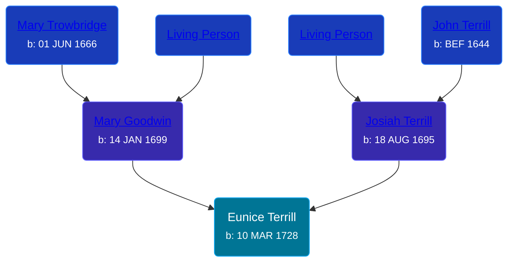

## 🟣 Eunice Terrill

Daughter of [Josiah Terrill](/people/8/80183041) and [Mary Goodwin](/people/4/49404198)





### 📆 Events


Type | Date | Age at Event | Place
------ | ------ | ------ | ------
[Birth](#event-event-2) | 10 MAR 1728 |  | Milford, Connecticut, USA



- **[Birth](#event-event-2)**
**Date**: 10 MAR 1728, Age:
**Place**: Milford, Connecticut, USA


### 📰 Event Sources

####  Birth, 10 MAR 1728
* The Town and City of Waterbury, Connecticut  - 135
* Roger and Abigail (Ufford) Terrill and Some Descendants: 1632 - 1993  - 22