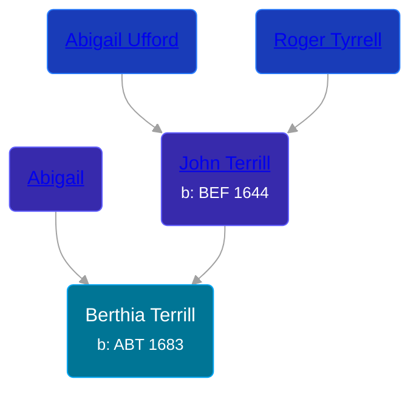

## 🟣 Berthia Terrill
<small>Age: 70y, 12m, 20d</small>

Daughter of [John Terrill](/people/6/65221157) and [Abigail ](/people/4/48582652)





### 📆 Events


Type | Date | Age at Event | Place
------ | ------ | ------ | ------
[Birth](#event-event-2) | ABT 1683 |  | Milford, Connecticut, USA
[Death](#event-event-3) | 20 DEC 1753 | 70y, 12m, 20d | Wallingford, Connecticut, USA



- **[Birth](#event-event-2)**
**Date**: ABT 1683, Age:
**Place**: Milford, Connecticut, USA
- **[Death](#event-event-3)**
**Date**: 20 DEC 1753, Age: 70y, 12m, 20d
**Place**: Wallingford, Connecticut, USA


### 📰 Event Sources

####  Birth, ABT 1683
* Roger and Abigail (Ufford) Terrill and Some Descendants: 1632 - 1993  - 10

####  Death, 20 DEC 1753
* Roger and Abigail (Ufford) Terrill and Some Descendants: 1632 - 1993  - 10