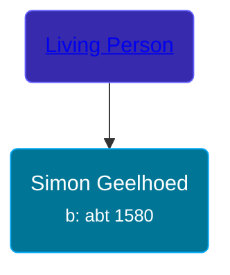

## 🔵 Simon Geelhoed
<small>Age: 63y, 4m, 4d</small>

Son of [Living Person](/people/5/5696556)





### 📆 Events


Type | Date | Age at Event | Place
------ | ------ | ------ | ------
[Birth](#event-event-2) | abt 1580 |  |
[Death](#event-event-3) | 04 APR 1643 | 63y, 4m, 4d |



- **[Birth](#event-event-2)**
**Date**: abt 1580, Age:
**Place**:
- **[Death](#event-event-3)**
**Date**: 04 APR 1643, Age: 63y, 4m, 4d
**Place**:


## 👩‍❤️‍👨 Relationships

### 🟣 [Living Person](/people/1/19894026)

#### Children With Living Person
* 🔵 [Marinus Geelhoed](/people/4/47020978), b. abt 1605
### 📰 Event Sources

####  Birth, abt 1580
* Geelhoet, Geelhoed & Geelhoedt Genealogie

####  Death, 04 APR 1643
* Geelhoet, Geelhoed & Geelhoedt Genealogie