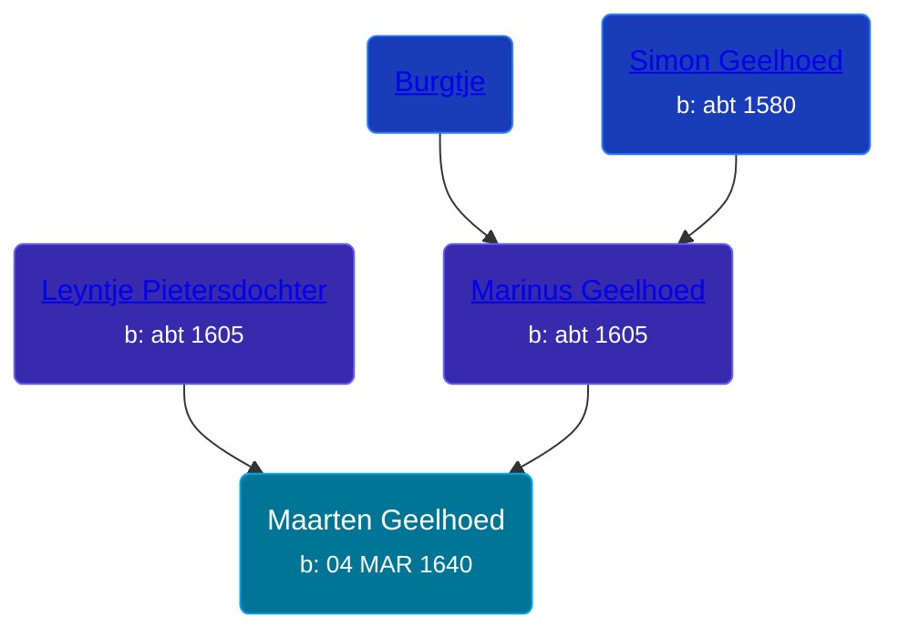

## 🔵 Maarten Geelhoed
<small>Age: 60y, 2d</small>

Son of [Marinus Geelhoed](/people/4/47020978) and [Leyntje Pietersdochter](/people/3/34853086)





### 📆 Events


Type | Date | Age at Event | Place
------ | ------ | ------ | ------
[Birth](#event-event-2) | 04 MAR 1640 |  |
[Death](#event-event-3) | 06 MAR 1700 | 60y, 2d |



- **[Birth](#event-event-2)**
**Date**: 04 MAR 1640, Age:
**Place**:
- **[Death](#event-event-3)**
**Date**: 06 MAR 1700, Age: 60y, 2d
**Place**:


## 👩‍❤️‍👨 Relationships

### 🟣 [Living Person](/people/4/45923848)

#### Children With Living Person
* 🔵 [Living Person](/people/2/2482812)
### 📰 Event Sources

####  Birth, 04 MAR 1640
* Geelhoet, Geelhoed & Geelhoedt Genealogie

####  Death, 06 MAR 1700
* Geelhoet, Geelhoed & Geelhoedt Genealogie