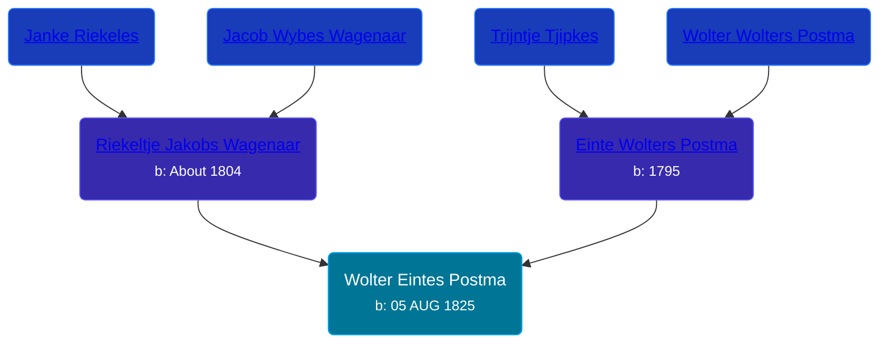

## 🔵 Wolter Eintes Postma
<small>Age: 47y, 6m, 10d</small>

Son of [Einte Wolters Postma](/people/1/18880768) and [Riekeltje Jakobs Wagenaar](/people/7/77820694)





### 📆 Events


Type | Date | Age at Event | Place
------ | ------ | ------ | ------
[Birth](#event-event-2) | 05 AUG 1825 |  | Netherlands
[Death](#event-event-3) | 15 FEB 1873 | 47y, 6m, 10d | Grootegast, Netherlands



- **[Birth](#event-event-2)**
**Date**: 05 AUG 1825, Age:
**Place**: Netherlands
- **[Death](#event-event-3)**
**Date**: 15 FEB 1873, Age: 47y, 6m, 10d
**Place**: Grootegast, Netherlands


## 👩‍❤️‍👨 Relationships

### 🟣 [Janke Johannes Nijboer](/people/4/49881856), b. about 1829

#### Events


Type | Date | Age at Event | Place
------ | ------ | ------ | ------
[Marriage](#event-family-0-event-0) | 30 APR 1853 | 27y, 8m, 25d | Achtkarspelen, Netherlands



- **[Marriage](#event-family-0-event-0)**
**Date**: 30 APR 1853, Age: 27y, 8m, 25d
**Place**: Achtkarspelen, Netherlands


### 📰 Event Sources

####  Birth, 05 AUG 1825
* Dutch Civil Register
>   
  > Source: Civil register - Birth  
  > Archive location: Tresoar, Frysk Histoarysk en Letterkundich Sintrum  
  > General Municipality: Achtkarspelen  
  > Type of record: Geboorteakte  
  > Record number: B 60  
  > Registration date: 08-08-1825  
  > Child: Wolter Eintes Postma  
  > Gender: M  
  > Date of birth: 05-08-1825  
  > Father: Einte Wolters Postma  
  > Mother: Riekeltje Jakobs Wagenaar

####  Marriage, 30 APR 1853
* Dutch Civil Register
####  Death, 15 FEB 1873
* Dutch Civil Register
>   
  > Source Civil register - Death  
  > Archive location: Groninger Archieven  
  > General Municipality: Grootegast  
  > Type of record: overlijden  
  > Record number: 22  
  > Registration date: 17-02-1873  
  > Deceased: Wolter Eintes Postma  
  > Gender: M  
  > Date of death: 15-02-1873  
  > Age: 46  
  > Place of death: Grootegast  
  > Father: Einte Wolters Postma  
  > Mother: Riekeltje Jakobs Wagenaar  
  > Partner: Janke Nijboer  
  > Relationship: echtgenoot  
  > Additional information: geboortepl: Surhuisterveen, gem.Achtkarspelen;beroep overl.: dagloner; beroep vader: dagloner
