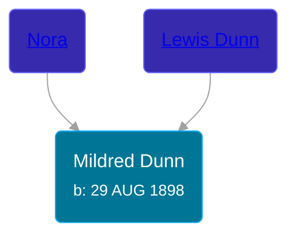

## 🟣 Mildred Dunn

Daughter of [Lewis Dunn](/people/1/14066328) and [Nora ](/people/3/37580902)





### 📆 Events


Type | Date | Age at Event | Place
------ | ------ | ------ | ------
[Birth](#event-event-3) | 29 AUG 1898 |  | Perry, Michigan, USA
[Residence](#event-event-0) | 12 APR 1930 | 31y, 7m, 13d | Rives, Jackson, Michigan, USA



- **[Birth](#event-event-3)**
**Date**: 29 AUG 1898, Age:
**Place**: Perry, Michigan, USA
- **[Residence](#event-event-0)**
**Date**: 12 APR 1930, Age: 31y, 7m, 13d
**Place**: Rives, Jackson, Michigan, USA


## 👩‍❤️‍👨 Relationships

### 🔵 [Edward Densmore](/people/7/75117844), b. 15 MAR 1891

#### Events


Type | Date | Age at Event | Place
------ | ------ | ------ | ------
Marriage | 05 JAN 1918 | 19y, 4m, 6d | Jackson, Michigan, USA
[Divorce](#event-family-0-event-1) | 17 JUN 1937 | 38y, 9m, 18d | Jackson, Jackson, Michigan, USA



- **Marriage**
**Date**: 05 JAN 1918, Age: 19y, 4m, 6d
**Place**: Jackson, Michigan, USA
- **[Divorce](#event-family-0-event-1)**
**Date**: 17 JUN 1937, Age: 38y, 9m, 18d
**Place**: Jackson, Jackson, Michigan, USA


#### Children With Edward Densmore
* 🟣 [Living Person](/people/3/37254066)
* 🟣 [Living Person](/people/2/22927641)
* 🔵 [Living Person](/people/7/79059120)
* 🟣 [Helen Mildred Densmore](/people/5/54702290), b. 15 APR 1925
* 🔵 [Living Person](/people/1/12457038)
* 🔵 [Richard Earl Densmore](/people/9/97910564), b. 17 JUL 1932
* 🔵 [Russell Merle Densmore](/people/4/47260456), b. 17 JUL 1932
### 📰 Event Sources

####  Birth, 29 AUG 1898
* Michigan, U.S., Birth Records, 1867-1914
>   
  > Name: Mildred B. Dunn  
  > Gender: Female  
  > Race: White  
  > Birth Date: 29 Aug 1898  
  > Birth Place: Perry, Michigan, USA  
  > Father: Lewis Dunn  
  > Mother: Nora Dunn  
  > Jurisdiction Number: 6173  
  > Reference Number: 144  
  >

####  Marriage, 05 JAN 1918
####  Residence, 12 APR 1930
* 1930 US Census

####  Divorce, 17 JUN 1937
* Michigan, Divorce Records, 1897-1952
>   
  > Name: Mildred B Densmore  
  > Marriage Date: 5 Jan 1918  
  > Marriage Place: Jackson, Michigan  
  > Decree Date: 17 Jun 1937  
  > Decree Place: Jackson, Michigan, USA  
  > Spouse: Edward Densmore  
  > State File Number: 38 3371  
  > Docket Number: 15-177  
  > Divorce Status: Granted  
  > Was Case Contested: No  
  > Number of Minor Children in Family: 6  
  > Cause: Ex Cruelty
